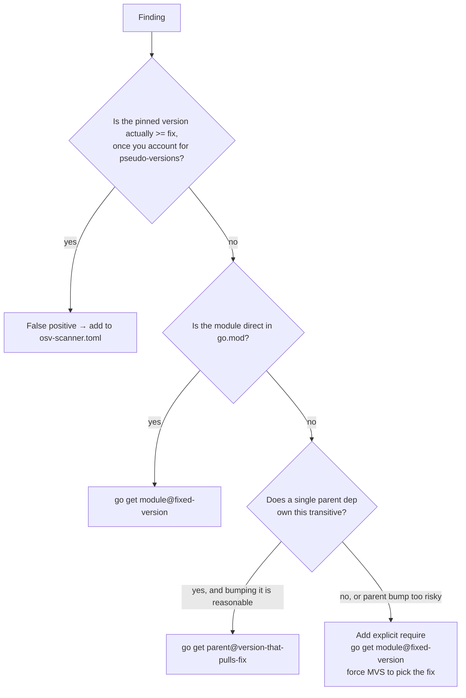

# cve-bump

End-to-end workflow for clearing CVEs in kgateway's Go dependencies. The user
wants a single pass: discover the alerts → decide the action for each →
present a plan → apply the bumps and ignore-list updates → verify locally.

## Why this skill exists

CVE patching in kgateway is more mechanical than it looks, but the moving
parts are easy to miss:

- The scanner findings live in GitHub code-scanning, not the local tree.
  `hack/osvtool` is the canonical way to fetch them.
- Findings are uploaded per-branch and only the supported branches
  (`main`, `v2.1.x`, `v2.2.x`, `v2.3.x`) get scanned, so a topic branch has
  to query its base branch.
- Some "vulnerabilities" are scanner false positives caused by
  pseudo-version comparison quirks (see the istio.io entries in
  `osv-scanner.toml`). These belong in the ignore list, not in go.mod
  churn.
- Indirect deps need either a `go get` of the parent that pulls in the
  fixed version, or an explicit `require` to force MVS to pick the fixed
  version. Getting this wrong looks like the bump "didn't take."

The skill encodes those decisions so the human only has to approve the
plan, not relearn the rules each time.

## Trigger fit

Strong fit when the user says any of:

- "patch the CVEs", "fix the CVEs", "clear the OSV alerts"
- "bump X for the CVE", "address GHSA-...", "what CVEs do we have?"
- "scanner is complaining about Y", "osv-scanner findings"
- "update deps for security"

Skip when the user wants a non-security dep bump (no CVE motivation) —
`hack/bump_deps.sh` and a plain `go get` are usually right for those.

## Tooling

This is a Go shop. The repo does not ship a Python toolchain and many
contributors do not have one installed — `pip install pyyaml` is **not**
a viable step.

For every parsing, filtering, or shaping task in this workflow, use:

- **`jq`** for JSON. Required by `hack/osvtool` already, so present
  whenever osvtool runs.
- **`yq`** for YAML. Also required by `hack/osvtool`. Use
  `yq -p=yaml -o=json` to convert the osvtool YAML back into JSON so
  `jq` can do the heavy lifting.
- **`go`**, `make`, standard shell builtins.

Do **not** reach for `python`, `python3`, `node`, `ruby`, or
`pip`/`npm install <anything>`. If you find yourself wanting one, write
a `jq` expression instead — every shape in the osvtool output (alerts,
rule metadata, message text, help tables) is straightforward to handle
in jq.

Concrete starter: to round-trip the saved YAML back to a JSON array of
alerts and start filtering:

```bash
yq -p=yaml -o=json /tmp/cve-bump/alerts-<branch>-<ts>.yaml \
  | jq '[ .[] | {
      ghsa: .rule.id,
      sev:  .rule.security_severity_level,
      msg:  .most_recent_instance.message.text,
      help: .rule.help,
      url:  .html_url
    } ]'
```

CVE IDs typically appear in `rule.full_description` or in the message
text alongside the package and version; the `help` field contains the
GO-XXXX-XXXX advisory table with fixed versions. Extract with `jq`'s
`capture` / regex helpers or a small `sed`/`grep` pipeline, not Python.

## Workflow

There are five phases. Do them in order; do not skip the planning phase
even if there is only one finding.

### 1. Detect the branch to scan

The osv-scanner workflow only uploads findings for the supported
branches. Topic branches must query the branch they are based on.

Run the detection helper:

```bash
.claude/skills/cve-bump/scripts/detect_base.sh
```

It prints one line: the supported branch the current HEAD is most
likely based on (most-recent merge-base across `main`, `v2.1.x`,
`v2.2.x`, `v2.3.x`), or `main` if it cannot decide.

Show the detected branch to the user and ask them to confirm or
override. Phrase it like: "Querying alerts for branch `<X>`. OK, or pick
another?" — short, no menu. Accept any of the four supported branches.

### 2. Pull the raw alerts

```bash
./hack/osvtool --raw --branch <branch> --target source --state open
```

Notes:

- `--target source` filters out container-image findings — those are
  fixed by Dockerfile or base-image changes, not Go dep bumps, so they
  are out of scope for this skill. Mention any image findings to the
  user in passing and move on.
- `--state open` is the default but be explicit so a future reader
  understands the intent.
- The output is YAML. Save it to a scratch path outside the repo so it
  is not accidentally committed. Use
  `/tmp/cve-bump/alerts-<branch>-<UTC-timestamp>.yaml` (mkdir -p first).
  This gives the user a record and lets us re-parse without another
  GitHub call.

If `osvtool` errors with an auth message, surface the help text it
prints — it already explains the fix (`gh auth refresh --scopes
security_events` or a fine-grained PAT). Do not paper over it.

### 3. Plan one action per finding

For each alert, extract:

- CVE ID (`rule.id` is typically the GHSA; the CVE lives in
  `rule.full_description` or `most_recent_instance.message.text`).
- Severity (`rule.security_severity_level`).
- Affected Go module + current pinned version.
- Fixed version (the lowest version that resolves the advisory).
- Whether the module is direct or indirect in this repo's go.mod.

Then pick an action per the decision tree below.

#### Decision tree



**Detecting pseudo-version false positives**: when the affected version
looks like `v0.0.0-<14-digit-timestamp>-<sha>` and the fix version is a
normal semver like `1.x`, OSV-Scanner compares them lexically as
`"0.0.0" < "1.x"` and fires regardless of whether the pinned commit
already includes the fix. Read the timestamp embedded in the
pseudo-version and compare to the fix release date. If the pinned
commit is newer, it is a false positive — add to `osv-scanner.toml`
with a reason that names the timestamp, the fix release date, and the
years/months gap. The five istio.io entries already in that file are
the model to copy.

**Choosing between parent bump and explicit require**: prefer the
parent bump when (a) the parent is itself behind by only a minor/patch
version, and (b) its changelog does not flag breaking changes for our
usage. Otherwise add an explicit require — it is the smallest possible
intervention and Go's MVS will honor it.

#### Output: the plan

Present the plan as a single fenced table the user can scan in one
look. Columns: `CVE | severity | module | from → to | action`. Example:

```
| CVE             | sev | module                | from           | to        | action                |
| --------------- | --- | --------------------- | -------------- | --------- | --------------------- |
| CVE-2025-1111   | H   | golang.org/x/net      | v0.20.0        | v0.27.0   | go get (direct)       |
| CVE-2025-2222   | M   | gopkg.in/foo.v3       | v3.1.0         | v3.2.1    | explicit require      |
| CVE-2022-31045  | H   | istio.io/istio        | v0.0.0-2026... | (n/a)     | ignore: false pos     |
```

Then ask the user to OK the batch or call out specific rows to change.
Wait for approval before touching files.

### 4. Execute

After approval, in order:

1. For each `go get` action: `go get <module>@<version>`.
2. `go mod tidy` once at the end.
3. For each ignore action: append a `[[IgnoredVulns]]` entry to
   `osv-scanner.toml`. The `reason` must be specific — name the
   pseudo-version timestamp, the fix release date, and the gap. Do not
   write generic reasons like "false positive" or "not applicable".
4. If `go.sum` changed, run `make generate-licenses` to refresh the
   license attribution files.
5. Run `make fmt-changed` to keep the diff clean.

Do not stage anything (`git add`) and do not commit. The user reviews
the dirty tree themselves.

### 5. Verify

The user signed off on "build + scanner re-run only", so:

1. `go build -tags e2e ./...` — the `e2e` tag is required to compile
   all source per the repo's CLAUDE.md. If the build fails, the bump is
   not safe; stop and report.
2. Local scanner re-run: **`make osv-scan`**. This is the canonical
   way to run OSV-Scanner locally in kgateway — it shells out to
   Docker (image `ghcr.io/google/osv-scanner-action`), so you do not
   need a local `osv-scanner` binary. Do **not** reach for a
   standalone `osv-scanner` invocation; the make target handles config
   lookup, output paths, and reporter conversion in one shot.
   - Results land at `_output/osv/<safe-branch>/results.json` (and a
     SARIF sibling). `<safe-branch>` is the current branch with `/` and
     `.` replaced by `-`.
   - The `make osv-scan` JSON schema is osv-scanner native
     (`results[].packages[].vulnerabilities[].id`), which is different
     from the GitHub code-scanning YAML from phase 2. To diff, extract
     the set of vuln IDs from each side with `jq`/`yq` and compare the
     sets — don't try to align records field-by-field. Report which
     CVEs the user expected to clear that still appear, and any new
     ones the scanner surfaced that were not in the original plan.
3. If Docker is not running, `make osv-scan` will fail with a Docker
   error. Tell the user and stop — do not try to install osv-scanner
   from source as a workaround.

### 6. Report

End with a brief summary listing each CVE, the action taken, and the
file(s) touched. The user reads this against `git diff` to verify.

## Edge cases worth knowing

- **Pseudo-version on the fix side**: rare, but if a fix only exists at
  a non-tagged commit, `go get module@<sha>` works. Mark this clearly
  in the plan so the user is not surprised by a pseudo-version in
  go.mod.
- **Module renamed/moved**: if the advisory's module path no longer
  exists upstream, a `replace` directive may be necessary. Treat this
  as ambiguous and flag it for the user instead of writing the replace
  silently.
- **Multiple CVEs on one module**: combine into a single `go get` to
  the highest required version. List them as separate rows in the plan
  table but mark "(combined bump)" in the action column.
- **Backport branches**: when scanning `v2.1.x` etc., the supported
  upgrade window for a given module may be narrower (e.g. cannot move
  to a new major). Default to the smallest version that resolves the
  CVE within the same major.
- **Topic branch with no alerts on the base branch**: possible if the
  branch was just rebased after a recent scan. Tell the user; offer to
  re-run after CI uploads fresh results.

## Files this skill touches

- `go.mod` / `go.sum` — version bumps
- `osv-scanner.toml` — false-positive ignore entries (root-level; this
  is the only scanner ignore file in this repo as of writing — `.snyk`,
  `.grype.yaml`, `.trivyignore` are not present)
- License attribution files, if `make generate-licenses` is wired up

## Bundled scripts

- `scripts/detect_base.sh` — prints the supported branch that the
  current HEAD is most likely based on. Used in phase 1.

## Things not to do

- Do **not** commit or stage. The user does that.
- Do **not** edit go.mod by hand — always go through `go get` so
  go.sum stays consistent.
- Do **not** add an `osv-scanner.toml` entry just to silence noise.
  The reason field has to defend the entry to a future reader.
- Do **not** run `make generate-all` or other heavy codegen targets
  for a dep bump — they are not needed for non-API changes and they
  slow the loop down by ~30s for no benefit.
- Do **not** scan an unsupported branch (e.g. `chandler/cveskill`)
  directly via `osvtool` — there are no GitHub-uploaded alerts for it.
  (Note: `make osv-scan` does work on any branch because it runs the
  scanner locally; that is fine for verification.)
- Do **not** reach for Python, Node, or any other parser. Use `jq`
  and `yq` — see the Tooling section.
- Do **not** invoke `osv-scanner` directly. Use `make osv-scan` — it
  runs the scanner in Docker with the right config and output paths.
