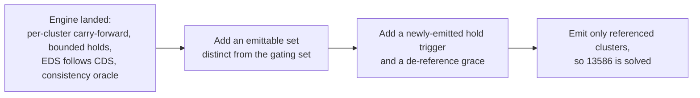

# EP-13586: Referenced-only cluster discovery on the publication engine

Status: Proposed (alternate variant)

- Issue: [#13586](https://github.com/kgateway-dev/kgateway/issues/13586)
- Related: [#10639](https://github.com/kgateway-dev/kgateway/issues/10639) (duplicate ask), [#14184](https://github.com/kgateway-dev/kgateway/issues/14184), [#14352](https://github.com/kgateway-dev/kgateway/issues/14352), [#14471](https://github.com/kgateway-dev/kgateway/issues/14471)
- Prerequisites, assumed landed by this variant: [#14343](https://github.com/kgateway-dev/kgateway/pull/14343) (shared base plus per-client overlay cluster state, `[WIP]`), [#14257](https://github.com/kgateway-dev/kgateway/pull/14257) (EDS hygiene, `[WIP]`), and the #14184 publication engine, currently the fork PR chandler-solo/kgateway#41 (`chandler/14184hybrid`, head `c6130128db`), which is stacked on both and must be upstreamed first.
- Alternate to: `13586-referenced-only-cluster-discovery.md`, the self-contained variant that assumes only `main`. Read the comparison at the end before choosing.

## Background

kgateway emits an Envoy CDS cluster, and an EDS `ClusterLoadAssignment`, for **every** Service in its discovery scope. #13586 reports ~279 Services discovered with 16 routed, and 93,126 `envoy_cluster_name`-labeled metrics per Envoy instance, more than the entire `kube-state-metrics` deployment, multiplied per replica and per gateway. `statsMatcher` is capped at 16 expressions and hides the symptom rather than the cost; `discoveryNamespaceSelectors` does not help when public and internal workloads share namespaces.

Emit-all is deliberate. It is make-before-break: RDS and CDS apply as separate events, so retargeting `/foo: service-a -> service-b` returns `503 NC` unless `service-b`'s cluster is already present. Pre-creating a cluster per Service guarantees that. **The prerequisite for referenced-only discovery is therefore safe cluster transitions, not a filter.**

### What the assumed prerequisites provide

This section is verified against the engine branch, not against PR prose. Paths are relative to `pkg/kgateway/proxy_syncer/` unless noted.

From **#14343**, in `backends.go`:

- `baseEnvoyCluster` - one row per backend, translated once and shared across every client, holding `sharedproto.Shared[*envoyclusterv3.Cluster]` so no consumer can mutate the shared proto.
- `uccClusterDelta` - a per-client row materialized only when a `PerClientClusterOverlay` applies, when the cluster needs an inline CLA, or when strict-mode validation fails for that client. This is what takes the per-client cluster footprint from O(N*M) to O(N*K) with K the count of backends that genuinely vary per client.
- `FetchClustersForClient(kctx, ucc) []uccWithCluster` - merges base and delta at snapshot assembly, delta winning. A base whose `Base.NeedsInlineCLA()` is true and whose delta has not landed is withheld rather than published CLA-less.

From **#14257**, in `perclient.go`:

- `filterEndpointResourcesForClusters(clusters, endpoints) (Resources, map[string]struct{})` - computes the EDS names required by the CDS set via `endpointResourceNameForCluster`, drops every CLA not required (STATIC clusters, and EDS clusters no longer in CDS), synthesizes an empty CLA for each required name with no derived CLA, and returns the synthesized set. The result satisfies go-control-plane's `Snapshot.Consistent()` invariant: the EDS resource set is exactly the set of EDS names referenced by CDS.

From the **engine PR**:

- `collectReferencedClusters(routes, listeners)` (`perclient.go:396`), stored once per gateway as `GatewayXdsResources.ReferencedClusters` (`proxy_syncer.go:97,146`).
- `XdsSnapWrapper.{deferred, missingReferenced, missingEndpointsReferenced, erroredClusters}`, classified by `findMissingReferencedClusters` and `findMissingReferencedEndpointResources`. Presence, not contents: a derived-but-empty CLA is the backend's truth and never defers.
- `resolveDeferredPerCluster(snapWrap, published, holdFlips) (*Snapshot, []string)` (`kube_gw_translator_syncer.go:112`) - carries previously-published missing clusters forward with their CLAs, publishes truth for previously-referenced ones, holds routes, listeners, and secrets at published versions only when a **newly**-referenced cluster is not yet ready, and never resurrects an errored cluster (fail closed for conformance).
- `publishGate` (`publish_gate.go:81`) - all cache mutations under one mutex, `pending` first-publish timers and `pendingFlips` flip-release timers, both bounded by `KGW_PER_CLIENT_PUBLISH_BUDGET` (`Settings.PerClientPublishBudget`, `api/settings/settings.go:362`, default `15s`, `0` disables). Warm clients are detected by `hasPriorXDSVersion`.
- Observability: subsystem `xds_snapshot` (`metrics.go:12`) giving `kgateway_xds_snapshot_perclient_defers_total{reason}`, `_carried_clusters_total`, `_flips_held_total`, `_bounded_publishes_total{mode}`, `_inconsistent_snapshots_total`, `_deferred_withheld_total{reason}`; plus `kgateway_xds_nacks_total{type_url,gateway,namespace}` (`pkg/krtcollections/xds_nacks.go`). Plus `Settings.XdsSnapshotConsistencyCheck` (`settings.go:373`), a test-only consistency-checking cache decorator that fails any unit test whose publish is inconsistent, `hack/xds-consistency-check.sh`, and the `xds_warming` e2e suite.

And from `main` independently of those three: `Settings.EnableOrderedAds` (`api/settings/settings.go:272`, wired at `pkg/kgateway/setup/controlplane.go:114`), the wire-order probe harness `pkg/kgateway/setup/ads_delivery_order_test.go`, `KGW_XDS_FIRST_CONNECT_DELAY` (`pkg/krtcollections/uniqueclients.go`), and the local-cluster EDS scoping from `bc57f656fc`. The engine branch predates the last two, which matters below.

The engine PR explicitly assigns the rest of this work here. Its own notes: "delivery-order hardening beyond the reference-ahead shape (de-reference grace, ordered ADS) belongs to the referenced-only-discovery EP".

## Motivation

With the prerequisites landed, most of the machinery this feature needs already exists: serialized bounded publication, per-cluster carry-forward, a hold-and-release primitive with the right shape, EDS that follows CDS automatically, and a snapshot-consistency oracle wired into every unit test. What remains is genuinely small, and it is not what the first draft of this EP assumed it was.

Three things are still missing, and each is a real design decision rather than a wiring exercise:

1. The engine's referenced set is **not** an emittable set. It is a deliberately narrow, fail-open gating set.
2. The engine's hold triggers on cluster **unreadiness**. Referenced-only additions are ready, so nothing holds them.
3. The engine carries clusters forward only while they are still referenced. A de-referenced cluster is not carried, so removal ordering is unaddressed.

Getting any of these wrong converts a bloat fix into an outage, so each is treated below as a first-class part of the design.



## Goals

- Emit CDS and EDS only for clusters the generated Envoy configuration references, in both the proxy snapshot **and** the per-client control-plane state.
- Preserve make-before-break in both directions by extending the engine's existing hold and release primitives, adding no second publication path.
- Guarantee, as a checked invariant, that the emission filter can never manufacture a gate gap.
- Reuse the engine's consistency oracle and metrics so correctness regressions surface in CI rather than in production.

## Non-Goals

- Changing informer-level discovery. Watch-level scoping stays with `discoveryNamespaceSelectors` and the proposed Service label selector.
- Re-deciding the engine's readiness semantics. Presence-not-contents and the no-hold-for-derived-but-empty trade-off are settled by the engine PR and this EP does not reopen them.
- A user-facing `Backend` kube type.

## Implementation Details

### Configuration

- `Settings.ClusterDiscoveryMode` (`KGW_CLUSTER_DISCOVERY_MODE`), enum `All` (default) and `Referenced`, following the `ValidationMode` typed-enum plus `Decode` pattern.
- `Settings.ClusterReferenceAhead` (`KGW_CLUSTER_REFERENCE_AHEAD`, `metav1.Duration`, default `2s`), the newly-emitted hold window. Clamped by `PerClientPublishBudget`, which remains the outer bound, so this knob paces and the budget bounds.
- `Settings.ClusterDereferenceGrace` (`KGW_CLUSTER_DEREFERENCE_GRACE`, `metav1.Duration`, default a few seconds), removal-side retention.

This is one knob fewer than the self-contained variant, because the engine's flip-release deadline already supplies the outer bound. `EnableOrderedAds` remains independent hardening.

### Translator and Proxy Syncer

#### Two reference sets, never unified

The single most important design point in this variant.

`collectReferencedClusters` extracts cluster names from exactly two message types, `envoyroutev3.RouteAction` and `envoytcpv3.TcpProxy`, through their `Cluster` and `WeightedClusters` specifiers. The generic recursion around it (`collectNestedProtoClusterReferences`, `collectProtoClusterReferencesFromValue`) does descend into every message, list, map, and `anypb.Any`, so the *traversal* is complete. The *extraction* is a two-type allowlist, and that is intentional. Its doc gives the reason: gating on ancillary references would starve an entire gateway forever on a plugin bug, so publishing and letting the filter fail is the better failure mode.

That narrowness is correct for gating and **fatal for emission**. The doc's first justification does not hold in the tree:

> The plugin that emits the filter is responsible for also emitting the ancillary cluster in the same per-gateway snapshot's ExtraClusters.

Verified false for backend-referenced ancillary clusters. Only two `ResourcesToAdd()` implementations return anything: `backendPlugin.ResourcesToAdd()` (`pkg/kgateway/extensions2/plugins/backend/plugin.go:422`) contributes the GCP metadata cluster, and `trafficPolicyPluginGwPass.ResourcesToAdd()` (`traffic_policy_plugin.go:743`) contributes **Secrets only, no clusters**. Meanwhile `jwt.go:298` resolves its JWKS target with `resolver.GetBackendFromRef(...)` and emits `backend.ClusterName()` into `HttpUri_Cluster`. The same pattern appears in `trafficpolicy/gateway_extension.go:304,355`, `trafficpolicy/oauth2.go:247,399`, and `listenerpolicy/common.go:22`. Every one of those names an ordinary **per-client backend cluster**, the exact population an emission filter removes.

The existing golden fixture `pkg/kgateway/translator/gateway/testutils/outputs/jwt/remote-jwks-async.yaml` is the proof. `kube_default_remote-jwks_8080` is an EDS backend cluster whose only reference is

```text
Listener -> filter_chain -> HttpConnectionManager -> http_filters[jwt/default/jwt-ext]
  -> ExtensionWithMatcher -> ExecuteFilterAction -> JwtAuthentication
  -> providers[jwt-ext_default_async-provider].remoteJwks.httpUri.cluster
```

which `collectReferencedClusters` walks past without extracting. Filtering emission on that set drops the cluster and breaks JWT validation permanently, with no route-level symptom.

So this EP adds a **second** set from the same traversal, and the two must stay separate:

```go
// collectEmittableNames returns every string scalar appearing anywhere in the
// generated RDS/LDS, including inside typed_config. Deliberately wider than
// collectReferencedClusters: over-collection emits a spurious cluster (today's
// behavior for that one cluster), under-collection is a permanent outage.
func collectEmittableNames(routes, listeners envoycache.Resources) map[string]struct{}
```

Collecting every string scalar is the correct bias. Any reference to a cluster is a string, so no reference shape, present or future, can escape it. A header value that happens to equal a generated cluster name (`buildClusterName` forms such as `kube_default_httpbin_8080`) emits one harmless extra cluster.

Do **not** widen `collectReferencedClusters` to serve both. Widening it feeds ancillary names into `findMissingReferencedClusters`, which sets `deferred`, which gates publication, which is exactly the whole-gateway starvation its comment warns about. Two sets, one walk, opposite failure biases:

| Set | Consumers | Bias | Failure mode if wrong |
|---|---|---|---|
| `ReferencedClusters` | `findMissingReferenced*`, `deferred`, `resolveDeferredPerCluster`, warm withhold | narrow, fail-open | a real gap is not gated: a flip lands on a warming cluster, transient 503 |
| `EmittableNames` | emission filter only | wide, fail-safe | a needed cluster is dropped: permanent 503 or a silently broken filter |

Both are stored on `GatewayXdsResources`, computed once per gateway per translation because `Any` unmarshalling on large LDS and RDS is not free and every client of a role shares the result:

```go
ReferencedClusters   map[string]struct{} // existing, gating
EmittableNames       map[string]struct{} // new, emission  // +noKrtEquals (covered by the hash)
EmittableNamesHash   uint64
```

with `EmittableNamesHash` folded into `GatewayXdsResources.Equals`.

#### The invariant that makes this safe

> `ReferencedClusters` must always be a subset of `EmittableNames`.

This is not decoration. If the emission filter drops a cluster that is in `ReferencedClusters`, `findMissingReferencedClusters` reports it as missing, the wrapper becomes `deferred`, and every publication for that client routes through `resolveDeferredPerCluster`. For a warm client the engine's documented residue then applies: a warm post-restart client whose gap is a CDS-missing cluster stays withheld, visible only on `_deferred_withheld_total`. The engine treats that state as a plugin-bug class because on stock code a missing CDS cluster cannot arise from configuration. An emission filter can manufacture it. Referenced-only would convert a rare residue into a routine freeze.

The invariant holds by construction: `EmittableNames` collects every string, `ReferencedClusters` collects a subset of strings from the same protos. It must nonetheless be asserted, because it is the property everything else rests on:

- a unit assertion over the golden corpus, computing both sets for every fixture and failing on any element of the gating set absent from the emittable set;
- a cheap production assertion at assembly under `XdsSnapshotConsistencyCheck`, incrementing a counter and falling back to emit-all for that gateway if it is ever violated.

#### Guard against unresolvable references

If the walk encounters `RouteAction.cluster_header` or a `ClusterSpecifierPlugin`, the gateway falls back to emit-all, increments `kgateway_xds_cluster_filter_disabled`, and logs once. kgateway generates neither today, verified across `pkg/` and `internal/`, so this is future-proofing that fails safe rather than silently.

#### Emission filter placement

The filter applies inside the `clusterSnapshot` transform of `snapshotPerClient` (`perclient.go:70`), where `FetchClustersForClient` materializes the per-client cluster map, with `EmittableNames` fetched by `krt.FetchOne(kctx, mostXdsSnapshots, krt.FilterKey(ucc.Role))`.

This placement differs from the self-contained variant, deliberately, and the difference is the main structural payoff of #14343. Because base translation is shared and deltas are sparse, the only per-client cluster state of any size is the assembled map. Filtering there shrinks the per-client **control-plane** footprint as well as the proxy's, which turns a Non-Goal of the self-contained variant into a Goal here.

Filtering upstream of `xdsSnapshotsForUcc` does introduce a cross-collection dependency: the cluster map is now filtered against a referenced set fetched separately from the routes assembled at `xdsSnapshotsForUcc`, so the two could in principle come from different generations. Under this variant that skew is **already handled** rather than newly dangerous, which is why the placement is safe here and was not in the self-contained variant:

- Both `clusterSnapshot` and `xdsSnapshotsForUcc` fetch by `ucc.Role`, so they converge on the same `GatewayXdsResources` within one KRT settle.
- If they transiently disagree such that a published route names a filtered-out cluster, that is exactly a `missingReferenced` gap. The engine classifies it, `resolveDeferredPerCluster` carries the previously-published cluster forward, and the route keeps working. The failure mode of the skew is *the case the engine was built for*.
- `_defers_total{reason="missing_clusters"}` and `_carried_clusters_total` make any such skew visible instead of silent.

Mechanics:

- Emit a `uccWithCluster` only when its `Name` is in `EmittableNames`; the engine's existing skip of `Error != nil` clusters is unchanged.
- Fold `EmittableNamesHash` into `clustersHash` so the CDS version moves when the emitted set changes.
- `listenerRouteSnapshot.Clusters` (`ExtraClusters`) continues to merge unconditionally at `perclient.go:237`. The GCP metadata cluster is the only member today, it is self-contained, and it is not part of the Service inventory that bloats `config_dump`.
- `wellknown.BlackholeClusterName` is never a translated backend cluster and is already special-cased throughout the engine, so it needs no filter case.
- Names can be gateway-scoped (`gatewayBackendClientCertificateExtraKey`), which is consistent because both sets are per-gateway and are compared only against that gateway's own clusters.

#### EDS needs no new code, but does need one reconciliation

`filterEndpointResourcesForClusters` derives the emitted EDS set positively from the emitted CDS set, so shrinking CDS shrinks EDS with zero additional logic, and every published snapshot stays `Consistent()`. This is a genuine simplification over the self-contained variant, which has to write and test its own dropped-set filter.

One prerequisite reconciliation, which no branch has done yet, because the engine branch predates `bc57f656fc`:

The local-cluster CLA (`local_cluster.go`, `NewPerClientLocalClusterEndpoints`) is an EDS resource for a cluster defined in the Envoy **bootstrap**, so it has no CDS entry. `filterEndpointResourcesForClusters` builds `requiredEndpointNames` from CDS items and drops every CLA not required, so **as written it drops the local-cluster CLA**. `Snapshot.Consistent()` agrees with the filter and not with the resource: it requires the EDS set to be exactly the CDS-referenced EDS names, so keeping the CLA would fail the consistency oracle. Meanwhile `bc57f656fc` exists because the *opposite* mistake also breaks: per `#14471`, an EDS resource the client never named makes go-control-plane's ADS superset check withhold that client's entire EDS response, which is why the CLA is offered only to clients whose subscription named it (`ucc.KnowsLocalCluster`).

Both constraints are real and they are in tension, so the merge must resolve it explicitly. The workable resolution is to treat bootstrap-defined EDS names as a first-class allowlist: thread the client's local-cluster name into `filterEndpointResourcesForClusters` as an additional required name, and exempt it from the `Consistent()` comparison the decorator performs. This EP does not depend on which resolution is chosen, but it cannot ship on a filter that silently deletes the resource, and the emission filter makes the CDS set smaller, which makes the collision strictly more likely.

#### Delivery ordering, and why the engine's hold does not fire

The engine gives route flips a reference-ahead **shape**: when a flip is held, routes, listeners, and secrets stay at published versions while the new CDS and EDS go out, so the cluster is delivered in an earlier snapshot than the route that uses it. That is exactly the property referenced-only needs.

It does not fire for referenced-only additions. The hold triggers on `deferred`, which is set when a referenced cluster is absent from CDS or its CLA was never derived. Under referenced-only, a newly-referenced cluster enters `EmittableNames` in the same build, so it **is** present in CDS and its CLA is normally derived. The build is not deferred, `resolveDeferredPerCluster` is never called, and cluster plus retarget publish in one snapshot. The engine's addition-side safety is real but orthogonal: it covers *unready* clusters, and referenced-only additions are ready.

Publishing them together is not safe, per the in-tree probes in `pkg/kgateway/setup/ads_delivery_order_test.go`, each scenario run in both server modes and all passing:

- `TestADSQuietStreamAdditionDeliversClusterBeforeRoute` - on a quiet stream the `ads=true` cache type-sorts pushes and CDS precedes RDS even unordered. The unordered server's `reflect.Select` drain randomizes only when several per-type channels are ready at once, which happens under flow-control stalls and back-to-back snapshots. `WithOrderedADS()` closes that residual window.
- `TestADSAckSkewDeliversRouteBeforeClusterEvenWhenOrdered` - **ACK skew defeats both modes.** After a CDS response is sent its watch is closed until ACK; a snapshot landing in that window finds only the RDS watch open, so the route reaches the wire before its cluster. SotW answers open watches only, and no server option changes that.
- `TestADSCombinedRemovalDeliversClusterRemovalBeforeRouteDereferenceWhenOrdered` - delivered type order is CDS before RDS, which is the wrong order for removals.

Emit-all is immune because destinations were delivered and ACKed long before any route named them.

#### Extension one: a newly-emitted hold trigger

`resolveDeferredPerCluster` already takes `holdFlips bool` and already knows how to hold routes, listeners, and secrets while carrying the held routes' cluster and CLA dependencies forward. This EP adds a second reason to enter that path, so no new publication path appears:

- Classify, alongside `missingReferenced` and `missingEndpointsReferenced`, a `newlyEmitted []string`: names in this build's emitted cluster set that are absent from the currently-published CDS **and** are named by this build's routes or listeners.
- Treat a non-empty `newlyEmitted` as flip-blocking in `resolveDeferredPerCluster`, using the identical hold. The published RDS, LDS, and Secrets stay; the new CDS and EDS go out.
- Release through `publishGate.pendingFlips`, whose timer and `fireFlipRelease` already exist. The release window is `ClusterReferenceAhead`, clamped by `PerClientPublishBudget`.

Because the newly-emitted cluster is *ready* rather than unready, the release condition is purely about delivery, and the right accelerator is Envoy's **EDS subscription** naming the cluster, not its CDS ACK. A CDS ACK proves acceptance, not routability: an EDS cluster stays warming until its CLA arrives. Envoy requests EDS for a cluster only after applying its CDS entry, so a `DiscoveryRequest` naming it is strictly stronger evidence, and its ACK stronger still. The observation point already exists, since `recordNackIfAny` (`pkg/krtcollections/xds_nacks.go:39`) already sees every `DiscoveryRequest`.

The EDS subscription is also the signal that a specific transient has cleared. During the hold the snapshot contains a CLA for a cluster the client has not yet named, and `snapshotCache.respond` (go-control-plane `pkg/cache/v3/simple.go:487`) skips a named ADS watch entirely when the snapshot for that type is not a subset of the requested names. So the client's **whole** EDS response is skipped until it re-requests. It self-heals immediately, because applying the new CDS makes Envoy send a fresh EDS request naming the new cluster, which the same snapshot then answers in full. The cost is one skipped EDS response, and observing the new request is precisely the confirmation that both the hold and the skip are over. CDS and LDS are wildcard subscriptions, so they are unaffected; per go-control-plane's own note, "clusters and listeners are requested without name references, so Envoy will accept the snapshot list of clusters as-is", which is also what makes a shrunken CDS authoritative and deleting.

Observation may only **shorten** the hold, never gate it. Cache keys are per unique client identity and replicas share a key while ACKs are per stream, so first-ACK release reintroduces the race for the others and slowest-ACK release lets one wedged or NACKing replica pin every replica of the gateway. That is the unbounded-withhold family the engine exists to remove. The budget remains the unconditional bound and `kgateway_xds_nacks_total` makes a NACK-driven window release attributable.

#### Extension two: de-reference grace

The engine does not cover removals, and its carry-forward is not a substitute. Carry-forward operates on `missingReferenced`, that is, clusters that are **still referenced** but absent from the build. A de-referenced cluster is no longer referenced, so it is never a carry candidate. Combined with a delivered type order of CDS before RDS, an immediate prune removes the cluster before the route stops using it.

- Record `dereferencedAt[name]` per client key when a cluster leaves `EmittableNames`. The emitted set becomes referenced-now plus recently-de-referenced within `ClusterDereferenceGrace`.
- Re-referencing clears the entry, so a flapping route keeps its cluster present instead of oscillating.
- On expiry, re-publish without the cluster. This runs on `publishGate` under the same mutex as every other publication, alongside `pending` and `pendingFlips`, driven by a `krt.RecomputeTrigger` in the same style as `pkg/krtcollections/uniqueclients.go:180`.

Because the retained cluster stays in CDS, `filterEndpointResourcesForClusters` keeps its CLA automatically, so graced clusters remain fully routable rather than becoming warming shells.

#### Worked example

```mermaid
sequenceDiagram
    participant R as Route /foo
    participant T as Assembly plus publishGate
    participant E as Envoy (ADS)
    Note over R: /foo: service-a -> service-b
    R->>T: routes now name b, not a
    T->>T: EmittableNames gains b; dereferencedAt[a] = now
    T->>T: emitted = referenced plus graced = {..., a, b}
    T->>T: newlyEmitted = [b] -> hold flips
    T->>E: snapshot 1 {CDS: a,b ; EDS: a,b ; RDS: /foo->a}
    Note over E: EDS watch skipped once (b not yet in requested names)
    E->>T: applies CDS b, re-requests EDS naming b, then ACKs
    Note over T: observed, or ClusterReferenceAhead elapsed,\nbudget as the outer bound
    T->>E: snapshot 2 {CDS: a,b ; RDS: /foo->b}
    Note over E: b applied and warmed, so the retarget cannot 503 NC\nin either server mode, regardless of ACK skew.\na still present, so in-flight traffic to a is safe
    Note over T: de-reference grace elapses for a
    T->>E: snapshot 3 {CDS: b ; EDS: b}
    E->>E: a removed only after no applied route uses it
```

### Reporting

Extend the engine's existing families rather than starting new ones:

- `kgateway_xds_snapshot_perclient_flips_held_total` gains a reason label distinguishing `unready` from `newly_emitted`, so the two triggers are separable in the field.
- New `kgateway_xds_snapshot_perclient_emitted_clusters` (gauge, per gateway) and `_dereference_grace_active` / `_dereference_pruned_total`.
- New `kgateway_xds_cluster_filter_disabled` for the unresolvable-reference fallback, and `_emittable_invariant_violations_total` for a `ReferencedClusters`-not-subset-of-`EmittableNames` breach.
- Status computation stays independent of the filter. A backend with an attached policy but no route reference still needs its status reconciled, and `FetchForStatus` already reads the base collection rather than the filtered assembly, so this holds without change.

### Test Plan

The engine supplies two harnesses this EP should lean on rather than duplicate: the consistency-checking cache decorator, which already fails any unit test whose publish violates `Snapshot.Consistent()`, and the `xds_warming` e2e suite.

- **Golden-corpus completeness property test.** For every fixture under `pkg/kgateway/translator/gateway/testutils/outputs/`, derive the cluster names mentioned anywhere in `Listeners` and `Routes` **independently** of production code (the golden files store `typed_config` decoded, so a plain tree walk reaches every reference) and assert `collectEmittableNames` returns a superset. Already validated by sweeping all 401 goldens: 925 backend clusters resolve to 425 referenced and 500 unreferenced with **zero false drops**, including two apparent bugs that were correct (`jwt/cross-namespace.yaml` has two JWKS Services, only the `kube_remote_` one referenced; `delegation/traffic_policy_filter_override_merge.yaml` drops `extproc2` because the merge leaves only `extproc1` referenced). The 54% ratio is a fixture artifact; the zero-false-drops result is the point.
- **Subset invariant test.** Over the same corpus, assert `ReferencedClusters` is a subset of `EmittableNames` for every fixture. This is the guard against manufacturing a gate gap.
- **Regression pin for the allowlist bug.** `jwt/remote-jwks-async.yaml` asserts `kube_default_remote-jwks_8080` survives the filter and, separately, that `collectReferencedClusters` still does not contain it, so a future well-intentioned widening of the gating set fails loudly.
- **Consistency oracle, for free.** Every new filter unit test publishes through the decorator, so any EDS/CDS divergence introduced by the filter fails without a bespoke assertion. Add the local-cluster CLA case explicitly, since that is the one resource the oracle and the resource disagree about.
- **Unit, collector guard.** Synthetic `cluster_header` and `ClusterSpecifierPlugin` routes each disable filtering for their gateway and bump the metric.
- **Unit, filter.** `Referenced` skips unreferenced backends and `All` is byte-identical to today; `ExtraClusters` always survive; graced clusters survive with their CLAs; base-plus-delta merge results are filtered identically whether the cluster came from a base or a delta.
- **Unit, newly-emitted hold.** Retarget `a -> b` yields snapshot 1 with CDS `{a,b}` and RDS still naming `a`, snapshot 2 with RDS naming `b`, then a later snapshot with `a` pruned; `_flips_held_total{reason="newly_emitted"}` increments; a flapping route does not oscillate; release happens on EDS subscribe plus ACK, on the window when no observation arrives, and never past the budget even with a NACKing replica.
- **Unit, skew tolerance.** Force `clusterSnapshot` and `xdsSnapshotsForUcc` to observe different `GatewayXdsResources` generations and assert the result is a classified `missingReferenced` gap with a carry-forward, not a published route naming an absent cluster.
- **Wire order.** Extend `pkg/kgateway/setup/ads_delivery_order_test.go` to drive the emission path through the ACK-skew and combined-removal scenarios.
- **Referenced-but-empty.** Scale-to-zero and ExternalName backends stay emitted, publish as truth, and never hold a retarget. This is the engine's semantics and the filter must not perturb it; add the case to `xds_warming`.
- **e2e and load.** The #13586 shape, hundreds of Services with a handful routed, yields counts proportional to referenced Services with stable traffic through churn. `make xds-consistency-check` and `kgateway_xds_nacks_total` assert zero after the run.

### Implementation phases

#### Phase 0: prerequisites

Upstream and merge #14343, #14257, and the engine PR. Exit criteria beyond "merged": `collectReferencedClusters`, `resolveDeferredPerCluster`, `publishGate`, `filterEndpointResourcesForClusters`, and `FetchClustersForClient` present on `main`; and the local-cluster EDS reconciliation above resolved, since #14257's filter as written drops that resource.

#### Phase 1: emittable set, dark

Add `collectEmittableNames` reusing the existing traversal with all-string extraction, plus the unresolvable-reference guard. Store `EmittableNames` and `EmittableNamesHash` on `GatewayXdsResources` next to `ReferencedClusters`. Land the completeness property test, the subset invariant test, and the allowlist regression pin. No consumer, so no behavior change.

#### Phase 2: filter at assembly, dark

Filter in `clusterSnapshot`; EDS follows through `filterEndpointResourcesForClusters` with no new code. Add `ClusterDiscoveryMode` but do not document `Referenced` as usable, since without Phase 3 additions are exposed to ACK skew. Tests: filter units through the consistency decorator, the skew-tolerance test, the `All`-mode byte-identical regression.

#### Phase 3: both extensions, mode becomes usable

Add the `newlyEmitted` classification and hold trigger in `resolveDeferredPerCluster`, the `dereferencedAt` state and prune timer on `publishGate`, and the EDS-subscription accelerator through the existing request callback. Add `ClusterReferenceAhead` and `ClusterDereferenceGrace`. Tests: hold units, extended wire-order probes, `xds_warming` additions. Document `Referenced` as supported and opt-in.

#### Phase 4: observability, docs, default

Land the metric additions and the `_flips_held_total` reason label, document the guarantee and both windows, and keep `All` as the default pending a soak.

## Alternatives

### Widen the gating set instead of adding a second set, rejected

Making `collectReferencedClusters` extract every string would give one set and delete `collectEmittableNames`. It also feeds JWKS, ext_authz, ext_proc, ratelimit, OAuth2, and access-log cluster names into `findMissingReferencedClusters`. Any plugin that names a cluster it does not produce would then set `deferred` for the whole gateway, and for warm clients the engine's CDS-missing withhold applies. The engine's own comment rejects this in advance: gating on ancillary references "would starve the entire gateway forever". The two-set design costs one map per gateway and buys opposite failure biases where each is needed.

### Rely on the engine's hold without a newly-emitted trigger, rejected

Tempting because the hold already has the right shape, and wrong because it triggers on unreadiness while referenced-only additions are ready. Shipping without the trigger means every route retarget onto a newly-emitted cluster is exposed to ACK skew, which the in-tree probe shows defeats both server modes. That is a bounded blip rather than a permanent break, so it could ship as an explicitly-documented opt-in, but it is not make-before-break and should not be described as such.

### Monotone sticky emission, never remove, rejected

Emit referenced-now plus ever-referenced-since-start and never remove. A cluster never sent cannot be in use, so declining to add it needs no removal machinery: no grace, no prune timer, no `dereferencedAt`. But the emitted set drifts back toward emit-all under churn and stale clusters persist until restart, so `config_dump` and `/stats` re-bloat, which is the actual complaint. It also still needs the newly-emitted hold, so it avoids only half the work, and it makes process restart semantically load-bearing.

### Service label selector, complementary

Extend discovery scoping with a Service label selector wired into `pkg/kgateway/extensions2/plugins/kubernetes/k8s.go`, so unmatched Services never become backends. Small, no coherence dependency, ships independently of all three prerequisites, and is the reporter's own ask. Requires operators to label workloads. Shipping it first as an immediate mitigation is reasonable and independent of this EP.

### Explicit Backend kube type plus disable-discovery

Users declare which Services become clusters, plus a setting to disable auto-discovery. Maximal control, largest UX change.

### Generalized NACK-defensive staged publication, rejected

Splitting any potentially-partially-rejected snapshot into prerequisite-first steps advancing on acknowledgment. Rejected for the same three reasons the engine work rejected it: per-key cache versus per-stream ACK, ladders superseded mid-flight under churn, and a marginal benefit that inverts stale-versus-truth during exactly the translation-bug class that strict validation and `kgateway_xds_nacks_total` already make loud. The two windows here are the bounded slice: routine transitions only, window-bounded, observation as accelerator only, no ladders.

## Choosing between the two variants

| | Self-contained variant | This variant |
|---|---|---|
| Prerequisites | none, ships on `main` today | three PRs, two marked `[WIP]`, one still on a fork |
| New publication machinery | a full per-client coordinator (state, mutex, timers, trigger) | none; two extensions to `publishGate` and `resolveDeferredPerCluster` |
| EDS alignment | new `filterEndpointResourcesForDroppedClusters`, dropped-set keyed | free via `filterEndpointResourcesForClusters` |
| Control-plane per-client memory | unchanged, explicit Non-Goal | shrinks too, because #14343 makes assembly the only per-client cluster state |
| Consistency enforcement | new property test only | property test plus the engine's consistency oracle in every unit test |
| New settings | three | two |
| Skew between routes and clusters | avoided structurally by filtering where both are present | tolerated, because the engine classifies and carries forward |
| Risk concentration | correctness of new timer and hold code | correctness of the subset invariant and the local-cluster reconciliation |

Both variants need the same over-approximating emittable set, the same guard, the same golden-corpus property test, and the same de-reference grace. That is the irreducible core of #13586. The difference is only whether the addition-side hold is written from scratch or grafted onto an existing bounded hold.

Recommendation: if the three prerequisites are landing anyway, this variant is the smaller and better-instrumented change, and the engine PR already assigns de-reference grace and ordered-ADS hardening to this EP. If they are not close, ship the self-contained variant, then collapse its coordinator into `publishGate` when the engine lands. Do not block a user-visible bloat fix on a three-PR stack whose predecessor was already reverted once.

## Risks and trade-offs

- **The subset invariant is the load-bearing safety property.** Violating it manufactures a `missingReferenced` gap, which for a warm client means a withhold the engine treats as a plugin-bug class. Holds by construction, asserted in CI, asserted again in production under `XdsSnapshotConsistencyCheck` with an emit-all fallback.
- **Reusing the narrow gating set for emission would be a shipping outage.** The engine's ancillary-exclusion rationale does not hold for backend-referenced ancillary clusters, and `jwt/remote-jwks-async.yaml` is the standing proof. Pinned by test in both directions.
- **The local-cluster EDS reconciliation is a prerequisite, not a detail.** As written, #14257's filter drops the resource `bc57f656fc` added and `#14471` motivated. The emission filter shrinks CDS further, making the collision more likely.
- **Delivery ordering remains the sharpest behavioral risk,** and the engine's existing hold does not cover it. `EnableOrderedAds` is busy-stream hardening, not an addition-side fix.
- **One skipped EDS response per reference-ahead hold,** from go-control-plane's ADS subset requirement in `respond`. Self-healing on Envoy's post-CDS re-request, observable as the accelerator signal, but real and worth documenting.
- **Removal correctness depends on the grace window** exceeding worst-case RDS propagation. Configurable for that reason.
- **Referenced-but-empty backends must stay publishable truth.** The engine guarantees it through presence-not-contents semantics; the filter must not perturb it, and does not, because such backends are referenced.
- **Behavior change.** Unreferenced Services disappear from `config_dump` and `/stats`. Intended, hence opt-in with a default of `All`.
- **Restart re-arms the addition path.** Every reference is newly-emitted after a controller restart, so the first retarget onto each backend takes the hold path. `KGW_XDS_FIRST_CONNECT_DELAY` and the first-publish budget cover initial convergence.

## Open Questions

- **How to reconcile the local-cluster CLA with `filterEndpointResourcesForClusters` and `Consistent()`.** This EP proposes a bootstrap-EDS allowlist threaded through the filter and exempted from the oracle, but the decision belongs with whoever merges #14257 against `bc57f656fc`.
- **Whether `ClusterReferenceAhead` should exist at all**, or whether the newly-emitted hold should release solely on EDS-subscription observation with `PerClientPublishBudget` as its only bound. That would remove a knob at the cost of a 15s worst case for a client that never re-requests.
- **Whether de-reference grace should prune or carry indefinitely.** This EP prunes on a timer. Indefinite carry is the monotone-sticky alternative and re-bloats.
- **Whether `_flips_held_total` should gain a reason label or a sibling metric**, given that the two triggers have different expected rates and very different meanings.
- **Whether to ship the Service label selector first** as an immediate mitigation while this stack lands.
