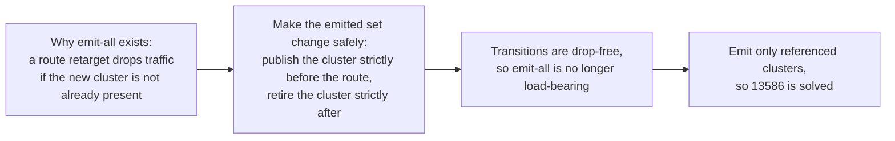

# EP-13586: Referenced-only cluster discovery without the publication engine

Status: Proposed

- Issue: [#13586](https://github.com/kgateway-dev/kgateway/issues/13586)
- Related: [#10639](https://github.com/kgateway-dev/kgateway/issues/10639) (duplicate ask), [#14184](https://github.com/kgateway-dev/kgateway/issues/14184) (per-client xDS coherence)
- Prerequisites: **none**. Every mechanism this EP relies on is either already merged or fully specified here.
- Companion: `13586-referenced-only-cluster-discovery.md` specifies the same feature on top of the #14184 publication engine, plus #14257 and the base/overlay stack (#14599, #14600, #14602). That is the smaller change if the stack lands, because the transition machinery is reused rather than written. The two share an irreducible core: the same over-approximating emitted set, the same unresolvable-reference guard, the same golden-corpus completeness property test, and the same de-reference grace. They differ only in whether the addition-side hold is specified here or grafted onto the engine's existing bounded hold.

## Background

kgateway emits an Envoy CDS cluster, and an EDS `ClusterLoadAssignment`, for **every** Service in its discovery scope, whether or not any route references it. `config_dump` lists a cluster for every Service in the cluster.

One reported environment measured about 279 Services discovered against 16 targeted by an `HTTPRoute`, and 93,126 metrics carrying an `envoy_cluster_name` label on each Envoy instance, more than its entire `kube-state-metrics` deployment. The cost is paid per proxy replica, per gateway, so a fleet carries the full unreferenced inventory in every proxy's memory and in every proxy's stats output.

Neither existing mitigation is sufficient. `statsMatcher` (GatewayParameters) trims stats but is capped at 16 expressions and is brittle as Service names churn. `discoveryNamespaceSelectors` scopes discovery by namespace, which does not help when public and internal workloads share one.

### Why kgateway emits all clusters today

This is deliberate. A route's destination cannot be changed without dropping traffic unless the destination cluster already exists. For `/foo: service-a -> service-b`:

- The route update (RDS) and the cluster update (CDS) are applied to Envoy as separate events.
- If the route retargets to `service-b` before its cluster exists, `/foo` returns `503 NC` (no cluster) for the gap.

Pre-creating a cluster for every Service guarantees the destination always exists. **Emit-all is a make-before-break workaround for not having safe cluster and route transitions.** This EP builds those transitions, which removes the justification.

## Motivation

Users are asking for a control plane that tells each proxy about the backends it actually uses. `statsMatcher` hides the symptom on the stats endpoint while the config, the memory, and the per-replica multiplication remain. The blocking reason has always been transition safety, not desirability, so the fix is to build the transitions. That splits into two independent problems:

1. **Which clusters belong in the snapshot.** A content question, solved by a referenced-set filter. Its entire difficulty is *completeness*: missing one reference is a permanent outage, not a blip.
2. **When each change reaches Envoy.** A delivery question. Snapshot coherence does not imply application order, so this needs staged publication, in both directions.



## Goals

- Emit CDS and EDS only for clusters the generated Envoy configuration actually references, eliminating unreferenced-cluster bloat in `config_dump` and `/stats`.
- Preserve make-before-break in **both** directions, with no `503 NC` on a route retarget and no endpoint drop on a de-reference.
- Make referenced-set completeness a **CI-enforced invariant** rather than a review obligation, because under-collection is a silent outage.
- Depend on no unmerged work, so this can land independently of #14184, #14257, and the base/overlay stack (#14599, #14600, #14602) while composing cleanly with them.
- Keep the behavior opt-in until a soak proves it.

## Non-Goals

- Changing how Services are watched at the informer level. This EP filters what is *emitted*, not what is *watched*. Coarser watch-level scoping remains the job of `discoveryNamespaceSelectors` and of the proposed Service label selector (Alternatives, Option B).
- Shrinking **control-plane** per-client memory. Filtering at assembly shrinks what each Envoy holds and reports, which is what #13586 asks for. Per-client cluster rows still materialize every backend; collapsing that is the base/overlay stack's job and composes with this EP (Alternatives, Option E).
- A user-facing `Backend` kube type for explicit cluster declaration (Alternatives, Option C).
- Per-client publication freezes, which are #14184.

## Implementation Details

### Configuration

- `Settings.ClusterDiscoveryMode` (`KGW_CLUSTER_DISCOVERY_MODE`), enum `All` (default) and `Referenced`, following the typed-enum plus `Decode` pattern of `ValidationMode` (`api/settings/settings.go`).
- `Settings.ClusterReferenceAhead` (`KGW_CLUSTER_REFERENCE_AHEAD`, `metav1.Duration`, default a few seconds), the addition-side hold. `0` publishes cluster and retarget together, accepting the ACK-skew blip.
- `Settings.ClusterDereferenceGrace` (`KGW_CLUSTER_DEREFERENCE_GRACE`, `metav1.Duration`, default a few seconds), the removal-side retention. `0` prunes immediately, accepting the removal race.

Two knobs rather than one, because they trade different things: de-reference grace trades `config_dump` residency, reference-ahead trades route-edit latency. Both are separately bounded by the publication coordinator's deadline. `EnableOrderedAds` remains an independent hardening option.

### Translator and Proxy Syncer

#### Defining the referenced set

The emitted backend-cluster set for a gateway is the set of translated cluster names appearing anywhere in that gateway's **generated** RDS and LDS protos.

Derivation is a generic `protoreflect` walk over `GatewayXdsResources.Routes` and `.Listeners`, unmarshalling every `anypb.Any` so names inside `typed_config` are visible, collecting **every string scalar** into a set:

```go
// collectReferencedNames walks generated RDS/LDS and returns every string scalar
// appearing anywhere in them, including inside typed_config extensions.
func collectReferencedNames(routes, listeners envoycache.Resources) map[string]struct{}
```

A cluster is emitted if and only if its name is a member. Because the filter only ever iterates clusters the translator actually produced, the intersection with "real cluster names" is implicit and no separate candidate set is needed.

`pkg/kgateway/proxy_syncer/xdswrapper.go` already contains the walker shape to follow: `visitFields` and `visitMessage` recurse through messages, lists, and maps and unmarshal nested `Any` payloads for redaction. The reference collector is the same traversal with collection instead of mutation, including its debug-log path for type URLs not linked into the binary.

#### Why an over-approximating collector rather than a typed allowlist

This is the load-bearing correctness decision.

A typed allowlist that extracts cluster names from `envoyroutev3.RouteAction` and `envoytcpv3.TcpProxy` is the natural implementation, and it is correct for a route-reachability readiness gate, where treating ancillary references as required would starve a gateway forever on a plugin bug. It is **not** correct for emission, because backend clusters are referenced by name from inside listener `typed_config`, nowhere near a `RouteAction`:

- JWKS: `pkg/kgateway/extensions2/plugins/trafficpolicy/jwt.go:308`
- OAuth2 token endpoint and JWKS: `trafficpolicy/oauth2.go:247,399`
- ext_authz gRPC and HTTP services: `trafficpolicy/gateway_extension.go:304,355`
- Access-log gRPC sinks: `pkg/kgateway/extensions2/plugins/listenerpolicy/common.go:22`

All of these call `BackendObjectIR.ClusterName()` (`pkg/pluginsdk/ir/backend.go:296`). They name a **per-client backend cluster**, the exact population this EP filters.

An existing golden fixture proves the failure mode. In `pkg/kgateway/translator/gateway/testutils/outputs/jwt/remote-jwks-async.yaml`, `kube_default_remote-jwks_8080` is an EDS backend cluster whose only reference is:

```text
Listener -> filter_chain -> HttpConnectionManager -> http_filters[jwt/default/jwt-ext]
  -> ExtensionWithMatcher -> ExecuteFilterAction -> JwtAuthentication
  -> providers[jwt-ext_default_async-provider].remoteJwks.httpUri.cluster
```

That is an `HttpUri.cluster` field nested several `Any` payloads deep. A two-type extractor does not see it, so a typed-allowlist filter drops the cluster and JWT validation fails permanently, with no route-level symptom pointing at the cause.

The risk is asymmetric, and that decides the design: under-collection drops a cluster Envoy needs, giving a permanent `503 NC` or a silently broken filter, while over-collection emits one cluster nothing routes to, which is exactly today's behavior for that one cluster. Collecting every string scalar biases toward the harmless side, since any reference to a cluster is a string and no reference shape, present or future, can escape it. The cost is that a header value or regex that happens to equal a cluster name emits a spurious cluster; given kgateway's generated names (`buildClusterName`, producing forms such as `kube_default_httpbin_8080`), collisions are vanishingly unlikely and benign.

#### Request-time destinations: detection and reference claims

A cluster selected at request time cannot be predicted, and this is the one class the all-string collector cannot reach by widening. A plugin may route dynamically: choose the destination per request, from a header or another request attribute, out of a candidate set that is never enumerated in the configuration. The typical shape is a cluster-specifier plugin whose script composes a name from a prefix, a request value, and a port, so no candidate name exists anywhere in the generated protos. The prefix inside the script is a substring of one string blob rather than a name, so the only thing collected is a declarative fallback field such as `default_cluster`.

Two mechanisms answer this, in order of precedence:

- **Detection, mandatory.** The walk treats all three request-time arms of the `cluster_specifier` oneof as unresolvable: `RouteAction_ClusterHeader`, `RouteAction_ClusterSpecifierPlugin`, and `RouteAction_InlineClusterSpecifierPlugin`. Naming all three matters, since the inline arm is the easiest to miss and a guard written against the other two would pass over it silently. On an unresolvable selector not covered by a claim, the gateway falls back to emit-all, increments `kgateway_xds_cluster_filter_disabled`, and logs once. Nothing in this tree generates any of the three today, verified across `pkg/` and `internal/`, but plugins built against it can, which makes this a shipping requirement rather than future-proofing.
- **Claims, the actual fix.** A backend plugin may contribute entries to the emitted set that the walk cannot derive, either as explicit names or as a predicate. The predicate form is what a dynamically routing plugin needs: `{namespace, port}`, admitting every backend cluster in that namespace on that port. Claims are per-gateway and collected alongside `ReferencedNames`, so a gateway whose unresolvable selectors are all claimed keeps filtering everywhere else instead of reverting wholesale. Without claims, one such backend in one namespace disables the feature for that entire gateway.

A claim must also cover the plugin's own resources. Such a plugin commonly emits an endpointless placeholder cluster so an unmatched request fails closed; once the route stops naming that placeholder, emission would otherwise prune the very cluster that makes the feature safe.

Failing to *detect* is worse than failing to *claim*. A dynamic selector typically tests whether its computed cluster exists and takes a default when it does not, so a pruned candidate does not return `503 NC`; every request silently lands on the fallback. Detection is what converts silent misrouting into a visible, metric-bearing loss of the optimization.

#### Cost and placement of the walk

The walk is O(config size) and runs **once per gateway per translation**, stored on `GatewayXdsResources`, not per client: `Any` unmarshalling on large LDS and RDS is not free, and all clients of a role share the result. `GatewayXdsResources` (`proxy_syncer.go`) gains:

```go
ReferencedNames     map[string]struct{} // +noKrtEquals (covered by the hash)
ReferencedNamesHash uint64
```

with `ReferencedNamesHash` added to `GatewayXdsResources.Equals` so the set participates in change detection in its own right, rather than relying on it to co-vary with `Routes.Version`.

#### Emission filter placement

The filter is applied in the `xdsSnapshotsForUcc` transform of `snapshotPerClient` (`perclient.go`), where the gateway's routes and the client's clusters, fetched via `PerClientEnvoyClusters.FetchClustersForClient` (`backends.go`), are **already both in hand**. It is not applied in the upstream `clusterSnapshot` transform.

This is a correctness requirement, not a style preference. `clusterSnapshot` keys on `ucc` and does not depend on `mostXdsSnapshots`; adding that dependency in order to filter there would let a cluster row be filtered against one generation of the referenced set while the routes published alongside it come from another. That is precisely the cross-collection skew documented by the `// HACK` comment in `perclient.go`. Filtering where both are present makes the invariant

> no published route names a backend cluster that this snapshot filtered out

true **by construction**, from a single `listenerRouteSnapshot`, with no timing assumption.

Mechanics:

- Iterate the fetched per-client clusters, emit those whose name is in `ReferencedNames`, and record the names skipped as `droppedClusterNames`.
- Fold `ReferencedNamesHash` into the cluster resources version, alongside the existing `clustersHash` XOR `ClustersHash` computation, so the CDS version moves when the emitted set changes.
- `listenerRouteSnapshot.Clusters` (`ExtraClusters`, contributed by plugins through `ResourcesToAdd()` in `pkg/kgateway/translator/irtranslator/gateway.go`) continues to be merged **unconditionally**. Those are self-contained ancillary clusters the config asked for, they are not part of the Service inventory that bloats `config_dump`, and excluding them removes an entire class of completeness risk.
- Blackhole semantics are unchanged: `wellknown.BlackholeClusterName` is never a translated backend cluster and so is never a filter candidate, and errored clusters are already skipped at assembly.
- Identity is compared on the name the translator produced. Names can be gateway-scoped (`gatewayBackendClientCertificateExtraKey` folds a per-gateway suffix into `extraKey`), which is consistent because the referenced set is per-gateway and is compared only against that gateway's own clusters.

#### EDS alignment

EDS must shrink with CDS, and the rule must be stated as **drop the CLAs whose clusters this snapshot dropped**, never as "drop CLAs for clusters not in CDS":

```go
func filterEndpointResourcesForDroppedClusters(
    endpoints envoycache.Resources, dropped map[string]struct{},
) envoycache.Resources
```

The distinction matters because not every legitimate CLA has a CDS entry in the snapshot. The local-cluster CLA (`local_cluster.go`) is an EDS-only resource for a cluster defined in the Envoy **bootstrap**, offered only to clients whose subscription asked for it. A "not in CDS" rule deletes it and breaks whatever consumes it. Keying on the exact set of names this snapshot filtered out cannot touch any resource the filter did not cause, which makes the rule safe for local-cluster CLAs, bootstrap clusters, and any future EDS-only resource.

This composes with the existing `filterEndpointResourcesForStaticClusters` (`perclient.go`) rather than replacing it. The two filters are independent and both run.

#### Delivery ordering

A coherent snapshot does not make Envoy *apply* CDS before RDS. The probes in `pkg/kgateway/setup/ads_delivery_order_test.go` pin the mechanics against the real go-control-plane server, each scenario run in both server modes:

- `TestADSQuietStreamAdditionDeliversClusterBeforeRoute`. On an otherwise idle stream, the `ads=true` `SnapshotCache` type-sorts its pushes (`go-control-plane/pkg/cache/v3/order.go`) and CDS reaches the wire before RDS even without ordered ADS. The non-ordered server's `reflect.Select` drain randomizes only when several per-type channels are ready simultaneously, which happens when a response is stalled in gRPC flow control or when snapshots arrive back to back. `WithOrderedADS()` closes that residual window.
- `TestADSAckSkewDeliversRouteBeforeClusterEvenWhenOrdered`. **ACK skew defeats both modes.** After a CDS response is sent, its watch stays closed until Envoy ACKs. If the next snapshot, carrying a new cluster plus a route retarget, lands in that window, the only open watch is RDS, so the route reaches the wire before any CDS carrying its destination. SotW can only answer open watches, and no server option closes this. The window is reachable exactly when a route is retargeted while an earlier CDS-only update is un-ACKed, which is routine under churn.
- `TestADSCombinedRemovalDeliversClusterRemovalBeforeRouteDereferenceWhenOrdered`. The delivered type order is CDS before RDS, which is the **wrong** order for removals: the cluster would go away before the route stops using it.

Emit-all is immune to all three, because destinations were delivered and ACKed long before any route named them. Referenced-only removes that immunity, so it has to be rebuilt deliberately. `Settings.EnableOrderedAds` (`api/settings/settings.go`, wiring `sotwv3.WithOrderedADS()` in `pkg/kgateway/setup/controlplane.go`) is useful busy-stream hardening and is orthogonal; it closes neither ACK skew nor removal ordering, as its own doc comment records.

#### Publication coordinator

One small per-client component provides both transition guarantees.

State per client key, under one mutex:

- `lastPublished`, the snapshot most recently written to the cache.
- `staged`, a held build awaiting reference-ahead release, plus its deadline.
- `dereferencedAt map[string]time.Time`, when each cluster left the referenced set.
- A `krt.RecomputeTrigger` to re-enter the transform when a timer fires. Precedents: `pkg/krtcollections/uniqueclients.go` and `pkg/kgateway/extensions2/plugins/backend/ec2.go`.

All cache mutations go through the coordinator, so a timer-driven publish can never interleave with a build-driven one.

**Addition, reference-ahead.** When a build both enlarges the emitted cluster set **and** changes RDS or LDS to name a newly-emitted cluster:

1. Publish the new CDS and EDS with the **previously published** RDS, LDS, and Secrets. The destination is now in Envoy, and no route names it yet.
2. Arm release with deadline `now + ClusterReferenceAhead`.
3. On release, publish the complete build. The retarget cannot `503 NC`, in either server mode, regardless of ACK skew.

This recreates, for exactly the transitional cluster, the property emit-all provided globally.

**Removal, de-reference grace.** When a cluster leaves the referenced set, record `dereferencedAt[name]`. The emitted set becomes referenced-now plus recently-de-referenced within the grace window. Re-referencing clears the entry, so a flapping route keeps its cluster present instead of oscillating. When the window elapses, the coordinator re-publishes without the cluster, under its own lock. This is the removal-side fix independent of delivery ordering, because the delivered order is structurally wrong for removals.

**Release signals: observe to accelerate, window to bound.** Both windows may be **shortened** by observation and must never be **gated** on it. The cache is keyed per unique client identity and replicas share a key, while ACKs arrive per stream: releasing on the first stream's ACK reintroduces the race for the others, and releasing only on the slowest lets one wedged or NACKing replica freeze retargets for every replica of the gateway, an unbounded withhold. A NACK counts as "will not ACK" and falls back to the window, which `envoy_xds_rejects_total` makes visible.

**The accelerator signal should be the EDS subscription for the new cluster, not the CDS ACK.** A CDS ACK proves the response was accepted, not that the cluster is routable: an EDS cluster stays in warming until its `ClusterLoadAssignment` arrives, and a route to a warming cluster still fails. Envoy requests EDS for a cluster only *after* applying its CDS entry, so a `DiscoveryRequest` naming that cluster is strictly stronger evidence, and its subsequent ACK stronger still. The observation point already exists: `logNackCallback.OnStreamRequest` (`pkg/kgateway/setup/envoy_error.go`) receives every request, with resource names on it. For non-EDS clusters (STATIC and similar) no EDS request is coming, so the CDS ACK is the best available signal. In all cases the deadline fires unconditionally, so a hold is bounded by construction.

#### Worked example

```mermaid
sequenceDiagram
    participant R as Route /foo
    participant T as Assembly plus coordinator
    participant E as Envoy (ADS)
    Note over R: /foo: service-a -> service-b
    R->>T: routes now name b, not a
    T->>T: ReferencedNames gains b; dereferencedAt[a] = now
    T->>T: emitted = referenced plus graced = {..., a, b}
    T->>E: snapshot 1 {CDS: a,b ; EDS: a,b ; RDS: /foo->a}
    E->>T: EDS request naming b, then ACK (b applied and warmed)
    Note over T: observed early, or ClusterReferenceAhead elapsed
    T->>E: snapshot 2 {CDS: a,b ; RDS: /foo->b}
    Note over E: b is already applied and warmed, so the retarget cannot 503 NC\nin either server mode, regardless of ACK skew.\na is still present, so in-flight traffic to a is safe
    Note over T: de-reference grace elapses for a
    T->>E: snapshot 3 {CDS: b ; EDS: b}
    E->>E: a is removed only after no applied route uses it
```

### Reporting

- Status computation stays independent of the emission filter. A backend with an attached policy but no route reference still needs its status reconciled. Emission decides what Envoy is told, not what kgateway reports.
- New metrics: `kgateway_xds_emitted_clusters` (gauge, per gateway, alongside the existing `snapshotResources` gauges in `perclient.go`); `kgateway_xds_reference_ahead_holds_total` and `kgateway_xds_reference_ahead_releases_total{reason="observed"|"window"}`; `kgateway_xds_dereference_grace_active` and `kgateway_xds_dereference_pruned_total`; `kgateway_xds_cluster_filter_disabled` for the unresolvable-reference fallback.
- Existing `envoy_xds_rejects_total` and `envoy_xds_rejects_active` (`pkg/kgateway/setup/envoy_error.go`) remain the NACK signal. A NACK during a hold surfaces as a `reason="window"` release.

### Test Plan

Completeness must become an enforced invariant, because a review-time checklist cannot survive the next filter type that names a cluster.

- **Golden-corpus completeness property test, the key guard.** For every fixture under `pkg/kgateway/translator/gateway/testutils/outputs/`, derive the set of cluster names mentioned anywhere in `Listeners` and `Routes` **independently** of the production collector (the golden files store `typed_config` decoded, so a plain tree walk over the YAML reaches every reference), then assert the production `collectReferencedNames` result is a superset. Two independent derivations cross-check each other over the whole corpus, so any new cluster-referencing filter shape fails CI the moment its fixture lands.

  The method is validated. Sweeping all 401 golden outputs, 925 backend clusters resolve to 425 referenced and 500 unreferenced with **zero false drops**; every drop inspected was genuinely unreferenced, including the two that look like bugs and are not (`jwt/cross-namespace.yaml`, where only one of two JWKS Services is referenced, and `delegation/traffic_policy_filter_override_merge.yaml`, where the merge leaves only `extproc1`). The 54% drop ratio is not a real-world estimate, since fixtures over-represent unreferenced backends; zero false drops is the meaningful part.
- **Unit, collector.** Route targets, weighted clusters, TCP and TLS targets, mirror backends, and each ancillary shape: `http_uri.cluster` for JWKS, `grpc_service.envoy_grpc.cluster_name` for ext_authz, ext_proc, rate limit, and access log, plus the OAuth2 token endpoint. `jwt/remote-jwks-async.yaml` is the regression pin for the typed-allowlist bug.
- **Unit, collector guard and claims.** Each of `RouteAction_ClusterHeader`, `RouteAction_ClusterSpecifierPlugin`, and `RouteAction_InlineClusterSpecifierPlugin` disables filtering for its gateway and bumps `kgateway_xds_cluster_filter_disabled`; a `{namespace, port}` claim over the same route restores filtering and admits exactly the claimed backends, including the claiming plugin's own placeholder cluster. Add a golden fixture for a dynamically routing plugin, whose candidate destinations are named nowhere in the input.
- **Unit, filter.** `Referenced` skips unreferenced backends; `All` is byte-identical to today; `ExtraClusters` always survive; a graced cluster survives; a local-cluster CLA survives, which is a direct regression pin for the EDS rule.
- **Unit, coordinator.** Retarget `a -> b` yields snapshot 1 with CDS `{a,b}` and RDS still naming `a`, snapshot 2 with RDS naming `b`, then a later snapshot with `a` pruned. A flapping route does not oscillate. Holds release on the window when no observation arrives, release early on EDS subscribe plus ACK, and a NACKing replica cannot extend a hold past its deadline.
- **Wire order.** Extend `pkg/kgateway/setup/ads_delivery_order_test.go` to drive the emission path through the ACK-skew and combined-removal scenarios, asserting that a retarget is never delivered before its cluster and a cluster removal never before its de-referencing RDS.
- **Referenced-but-empty.** A referenced backend that is legitimately empty (scale-to-zero, ExternalName) publishes as truth: never dropped, never defers publication, never holds a retarget.
- **Integration, envtest plus ADS.** Route destination changes produce no `503 NC` and no endpoint gap in `Referenced` mode, across HTTP, GRPC, TCP, and TLS, including delegated routes.
- **e2e and load.** The #13586 shape, hundreds of Services with a handful routed, yields cluster and metric counts proportional to referenced Services, with stable traffic through route churn.
- **Regression.** `All` mode byte-identical to today, asserted over the golden corpus.

### Implementation phases

Each phase is independently reviewable and revertible. Nothing user-visible ships before it is drop-free.

#### Phase 1: collector, dark

- Add `collectReferencedNames` as the generic traversal with all-string collection, plus request-time-selector detection over all three oneof arms and the plugin-facing claim API (explicit names and the `{namespace, port}` predicate). Detection and claims ship with the collector, so the filter can never be enabled without them.
- Store `ReferencedNames` and `ReferencedNamesHash` on `GatewayXdsResources` in `toResources` (`proxy_syncer.go`), and add the hash to `Equals`.
- Land the golden-corpus completeness property test and the collector unit tests.
- Nothing consumes the set yet, so there is no behavior change.

#### Phase 2: filter and EDS alignment, dark

- Apply the filter in `xdsSnapshotsForUcc`, and add `filterEndpointResourcesForDroppedClusters`.
- Add `ClusterDiscoveryMode` but **do not document `Referenced` as usable yet**. Without Phase 3 it is not drop-free, and shipping a knowingly-blippy mode is exactly the shortcut this EP exists to avoid.
- Tests: filter unit tests, the local-cluster CLA pin, and the `All`-mode byte-identical regression.

#### Phase 3: publication coordinator, mode becomes usable

- Add the coordinator (per-client state, mutex, `RecomputeTrigger`, deadlines) with reference-ahead and de-reference grace, plus `ClusterReferenceAhead` and `ClusterDereferenceGrace`.
- Add EDS-subscription and ACK observation as accelerators through `OnStreamRequest`, with the window as the unconditional bound.
- Tests: coordinator unit tests, the extended wire-order probes, and the integration churn matrix.
- Document `Referenced` as supported and opt-in.

#### Phase 4: observability, docs, default

- Add the metrics above so operators can see the reduction and the grace activity.
- Document the make-before-break guarantee, the two windows, and the behavior change: unreferenced Services no longer appear as clusters.
- Keep `All` as the default. Consider flipping only after a soak with the load matrix green.

## Alternatives

### Option A: monotone sticky emission, never remove

Emit referenced-now plus ever-referenced-since-process-start, and never remove a cluster once emitted. A cluster that has never been sent cannot be in use, so declining to add it is safe without any removal machinery: no de-reference grace, no prune timers, no removal-side observation, and no prune-versus-carry-forward question. It ships far sooner and degrades to today's behavior in the worst case.

Rejected because it does not solve #13586. The emitted set drifts monotonically toward emit-all under route churn, and clusters for deleted routes persist until the process restarts, so `config_dump` and `/stats` re-bloat over time, which is the actual complaint. It still needs reference-ahead for additions, so it avoids only half the machinery, and it makes process restart semantically load-bearing. The ask is a lean steady state, not a lean cold start.

### Option B: Service label selector, complementary

Extend discovery scoping with a Service label selector, a sibling to `discoveryNamespaceSelectors`, wired into the kube backend plugin (`pkg/kgateway/extensions2/plugins/kubernetes/k8s.go`) so unmatched Services never become a backend and therefore never a cluster. This is the ask from the reporter with the 93k-metric environment.

- Pros: small; no coherence dependency at all, since the operator controls the set explicitly and there is no transition to make drop-free; finer than namespace scoping; ships independently of everything here.
- Cons: the operator must label workloads and keep labels current, and it is opt-in scoping rather than automatic.

Not mutually exclusive with this EP. Option B is the quick standalone win, referenced-only is the automatic model.

### Option C: explicit Backend kube type plus disable-discovery

Add a kube-type `Backend` resource so users declare which Services become clusters, plus a setting to disable auto-discovery entirely. Maximal control, largest UX change.

### Option D: generalized NACK-defensive staged publication, rejected

A broader version of this EP's staged publication: split *any* snapshot whose partial rejection could yield an incoherent applied state into prerequisite-first snapshots, advancing each step on acknowledgment. Rejected on three counts.

- **Per-key cache versus per-stream ACK.** Replicas share cache keys, so ACK-gated advancement is either per-replica keys, undoing the identity collapse that controls per-client cost, or slowest-replica gating, where one wedged pod freezes updates for every replica of its gateway.
- **Ladders under churn.** Staged publication makes every build a multi-step state machine that must be reconciled against newer builds arriving mid-ladder. At the churn rates that motivate #14184, ladders are routinely superseded before completing.
- **It inverts the stale-versus-truth decision.** A partial NACK requires emitting a rejected proto, a translation bug class that strict validation pre-empts and `envoy_xds_rejects_total` makes loudly observable. During such a bug Envoy already holds last-accepted config per type; staging would keep serving stale targets while the bug is live, the opposite of fail-visible.

This EP's two windows are the deliberately bounded slice: they stage publication only where transitions are *routine operation* rather than a bug class, they remain window-bounded with observation as an accelerator only, and they add no ladders.

### Option E: build on the #14184 engine and the base/overlay stack, rejected as a prerequisite

The companion EP takes exactly that dependency, on the #14184 publication engine plus #14257 and the base/overlay stack (#14599 endpoint-mutation isolation, #14600 backend bases plus client overlays, #14602 sparse CDS storage). It is the better change *if* that stack lands: it needs no new publication machinery, gets EDS alignment for free, and shrinks per-client control-plane memory too. This variant exists so a user-visible fix does not have to wait on that scheduling, since everything it needs is either merged or small enough to specify here.

They compose. Once CDS is stored as shared bases plus sparse per-client overlays, the same filter can additionally skip per-client materialization for unreferenced backends, shrinking control-plane memory as well as proxy memory. If the #14184 engine's `publishGate` lands, this EP's coordinator should be folded into it rather than kept alongside, since they are the same primitive with different release conditions.

### Status quo mitigations

`statsMatcher` and `discoveryNamespaceSelectors`, insufficient for shared-namespace topologies and capped expression lists.

## Risks and trade-offs

- **Referenced-set completeness is the principal correctness risk**, which is why the collector over-approximates instead of allowlisting: a two-type extractor drops the JWKS cluster in an existing fixture. Mitigated structurally by collecting every string, by exclusion since `ExtraClusters` are never filtered, by the guard that disables filtering on unresolvable selectors, and by CI through the golden-corpus property test.
- **Request-time destinations are outside what any walk can derive.** Detection plus claims covers them, but the guarantee is only as good as the detection: an undetected selector prunes candidates the data plane then silently routes to a fallback rather than failing visibly. The survey must cover every plugin that ships against this tree, not only those in `pkg/` and `internal/`, before the filter is enabled by default.
- **Delivery ordering is the sharpest behavioral risk.** Coherent snapshots do not imply application order, and ACK skew delivers a retarget before its cluster in **both** server modes, as the in-tree probes pin. Mitigated by reference-ahead. `EnableOrderedAds` is hardening, not a fix.
- **Both windows need tuning.** De-reference grace must exceed worst-case RDS propagation or removals race; too long, and it delays route edits and retains clusters. Configurable for that reason, and both are bounded and observable.
- **Referenced-but-empty backends must remain publishable truth.** Scale-to-zero and ExternalName backends are referenced and legitimately empty, so they must never be dropped, defer publication, or hold a retarget. Pinned by test.
- **Behavior change.** Unreferenced Services disappear from `config_dump` and `/stats`, so dashboards or scripts relying on their presence will notice. Intended, hence opt-in with a default of `All`.
- **Control-plane memory is unchanged** by this EP. Only proxy-side config, memory, and stats shrink. See Non-Goals and Option E.
- **Restart re-arms the addition path.** After a controller restart every reference is new again, so the first retarget onto each backend takes the reference-ahead path. `KGW_XDS_FIRST_CONNECT_DELAY` (`pkg/krtcollections/uniqueclients.go`) covers the initial convergence window and the coordinator covers the rest.

## Open Questions

- **Default durations for the two windows**, and whether to derive them from observed per-type ACK latency, which the server callbacks expose, rather than from static values. Large fleets with batched route churn are where measured windows would matter most.
- **How expressive should a claim predicate be?** `{namespace, port}` covers the known request-time routing shape exactly and nothing more. Broader forms (label selectors, whole-namespace, cross-namespace) invite claims that re-admit most of the inventory and quietly restore emit-all without saying so. Worth deciding whether the effective emitted set should be observable per gateway, so an over-broad claim is visible rather than merely ineffective.
- **Whether to ship Option B, the Service label selector, first** as an immediate mitigation while this lands. Request-time destinations strengthen the case independently: operator-declared inclusion composes with unenumerable destination sets, which derived pruning cannot see at all.
- **Whether reference-ahead should also cover first-ever emission on a cold start**, or whether `KGW_XDS_FIRST_CONNECT_DELAY` plus the coordinator already suffice.
- **Whether the EDS-subscription accelerator is worth its bookkeeping** in v1, or whether window-only release should ship first with observation as a follow-up.
- **Whether to fold the coordinator into `publishGate`** if the #14184 engine lands during implementation, versus shipping both and merging them later.
