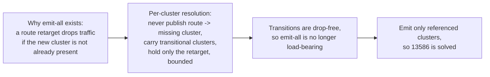

# EP-13586: Referenced-only cluster discovery

Status: Proposed

- Issue: [#13586](https://github.com/kgateway-dev/kgateway/issues/13586)
- Related: [#10639](https://github.com/kgateway-dev/kgateway/issues/10639) (duplicate ask), [#14184](https://github.com/kgateway-dev/kgateway/issues/14184) (per-client xDS coherence)
- Depends on: [#14343](https://github.com/kgateway-dev/kgateway/pull/14343) (shared-base plus per-client-overlay cluster translation), [#14257](https://github.com/kgateway-dev/kgateway/pull/14257) (EDS and CDS alignment), and the #14184 per-client publication engine. Enabled by [#14242](https://github.com/kgateway-dev/kgateway/pull/14242) and [#14253](https://github.com/kgateway-dev/kgateway/pull/14253) (validator cache).
- Companion: `13586-referenced-only-cluster-discovery-without-publication-engine.md` specifies the same feature with no prerequisites. This variant is the smaller change, and is the one to take if the stack above is close to landing.

## Background

kgateway emits an Envoy CDS cluster, and an EDS `ClusterLoadAssignment`, for **every** Service in its discovery scope, whether or not any route references it. `config_dump` lists a cluster for every Service in the cluster.

One reported environment measured about 279 Services discovered against 16 targeted by an `HTTPRoute`, and 93,126 metrics carrying an `envoy_cluster_name` label on each Envoy instance, more than its entire `kube-state-metrics` deployment. The cost is paid per proxy replica, per gateway, so a fleet carries the full unreferenced inventory in every proxy's memory and in every per-client snapshot.

Neither existing mitigation is sufficient. `statsMatcher` trims stats but is capped at 16 expressions and is brittle as Service names churn. `discoveryNamespaceSelectors` scopes by namespace, which does not help when public and internal workloads share one.

### Why emit-all exists

It is deliberate. A route's destination cannot be changed drop-free unless the destination cluster already exists. For `/foo: service-a -> service-b`:

- RDS and CDS are applied to Envoy as separate events.
- If the route retargets to `service-b` before its cluster exists, `/foo` returns `503 NC` for the gap.

Pre-creating a cluster for every Service guarantees the destination is always present. **Emit-all is a make-before-break workaround for not having safe cluster and route transitions.**

### What the publication engine provides

The #14184 work replaces the whole-snapshot "publish only when complete" gate with per-cluster resolution and bounded publication. Paths are relative to `pkg/kgateway/proxy_syncer/`:

- `collectReferencedClusters` (`perclient.go`) walks the **generated** RDS and LDS protos, descending into `typed_config` via protoreflect, and returns the cluster names the dataplane references. It is computed once per gateway and stored on `GatewayXdsResources.ReferencedClusters`.
- `resolveDeferredPerCluster` (`kube_gw_translator_syncer.go`) is the make-before-break primitive. Per cluster: previously-published clusters that vanish from a build are carried forward with their CLAs; previously-referenced clusters publish their truth; only a retarget onto a newly-referenced, not-yet-present cluster is held, with routes and listeners staying at their published versions while the new CDS and EDS go out. A route is never published naming a cluster the snapshot lacks.
- `publishGate` (`publish_gate.go`) serializes every cache mutation for a client under one lock, bounds the cold-start first publish, and arms a flip-release timer per held episode so a hold is always bounded. It is the template for any per-client timed publication state.
- `filterEndpointResourcesForClusters` (`perclient.go`) aligns emitted EDS to emitted CDS, so shrinking CDS shrinks EDS automatically. Readiness is **strict presence**: a derived-but-empty CLA is publishable truth, so a legitimately empty backend never defers; only genuinely absent resources do.
- #14343 splits per-client cluster translation into a shared `baseEnvoyCluster` collection plus sparse `uccClusterDelta`s, merged at assembly by `FetchClustersForClient`. Per-client CDS is materialized at assembly, which is where an emission filter is cheapest to apply.

Transitions are therefore drop-free **for whatever set the snapshot chooses to emit**. That set is currently "all backends". This EP makes it "referenced clusters" and lets the same machinery carry the transitions.

## Motivation

### Goals

- Emit CDS and EDS only for clusters the generated Envoy configuration references, eliminating unreferenced-cluster bloat in `config_dump` and `/stats`.
- Preserve make-before-break across route destination changes, with no `503 NC` and no endpoint drop, by reusing the per-cluster resolution primitives rather than emit-all.
- Keep the behavior opt-in until a soak proves it.

### Non-Goals

- Changing how Services are watched at the informer level. This EP filters what is *emitted*, not what is *watched*. Coarser scoping stays the job of `discoveryNamespaceSelectors` and the proposed Service label selector (Alternatives, Option B).
- A user-facing `Backend` kube type for explicit cluster declaration (Alternatives, Option C).
- Solving per-client publication freezes, which is #14184. This EP consumes its output.

## Key insight



A cluster set that is coherent-by-construction with the routes **is** the referenced-only set. #13586 reduces to assembling the emitted set from the referenced-cluster walk and letting per-cluster resolution plus two grace windows transition that set safely.

## Design

### The emitted set

The emitted cluster set for a gateway is the transitive closure of cluster names referenced by that gateway's **generated** Envoy configuration, not the set of route `backendRefs`. Deriving it from the produced protos is correct by construction for every destination chosen at translation time: the config names exactly what is emitted, and delegation, non-HTTP routes, and mirrors are covered for free because they already appear in the output.

A correct set includes route targets (`RouteAction.Cluster`, `WeightedCluster` entries, `TcpProxy.Cluster`), mirror and shadow backends, ancillary clusters named by filter configs (`ext_authz`, `ext_proc`, rate limit, access-log gRPC sinks, JWKS), and `wellknown.BlackholeClusterName` unconditionally, since routes whose backends fail resolution target it.

`collectReferencedClusters` cannot serve this directly. Its traversal descends into every message, list, map, and `anypb.Any`, but it **extracts** names only from `envoyroutev3.RouteAction` and `envoytcpv3.TcpProxy`. That allowlist is right for its purpose, a route-reachability readiness gate where treating ancillary references as required would starve a gateway on a plugin bug. It is wrong for emission, where those ancillary clusters are real clusters Envoy needs, and they are ordinary per-client backend clusters rather than self-contained extras: `jwt.go` resolves its JWKS target with `GetBackendFromRef` and emits `backend.ClusterName()`, which is exactly the population an emission filter removes.

This EP therefore adds `collectReferencedClustersForEmission`, reusing the same traversal but extracting **every string scalar**, stored as `GatewayXdsResources.ReferencedClustersForEmission`. The bias is deliberate and asymmetric: over-collection emits one spurious cluster, under-collection is a permanent outage.

The two sets stay separate, and `ReferencedClusters` must always be a **subset** of `ReferencedClustersForEmission`. If emission drops a cluster the gating set contains, `findMissingReferencedClusters` reports it missing, the wrapper defers, and a warm client hits the engine's CDS-missing withhold, turning a rare residue into a routine freeze. The subset property holds by construction, same walk with wider extraction, but must be asserted over the golden corpus and again in production under `XdsSnapshotConsistencyCheck`, with an emit-all fallback for the affected gateway. Widening `collectReferencedClusters` itself to serve both is rejected: it would feed ancillary names into the readiness decision, which is the whole-gateway starvation its own comment warns against.

### Reference claims for request-time destinations

One class of destination is invisible to any walk. A plugin may route dynamically: pick the destination per request, from a header or another request attribute, out of a candidate set the configuration never enumerates. The typical shape is a cluster-specifier plugin whose script composes a name from a prefix, a request value, and a port, so no candidate name appears in the generated protos. Widening the collector cannot reach these, because the prefix is a substring of one string blob rather than a name; the only names that surface are declarative fields such as a fallback `default_cluster`.

Two mechanisms, in order of precedence:

- **Detection, mandatory.** The walk treats all three request-time arms of the `cluster_specifier` oneof as unresolvable: `RouteAction_ClusterHeader`, `RouteAction_ClusterSpecifierPlugin`, and `RouteAction_InlineClusterSpecifierPlugin`. Naming all three matters, since the inline arm is the easiest for a guard to pass over silently. On an unresolvable selector not covered by a claim, the gateway reverts to emit-all, increments `kgateway_xds_cluster_filter_disabled`, and logs once.
- **Claims, the actual fix.** A backend plugin contributes emitted-set entries the walk cannot derive, as explicit names or as a `{namespace, port}` predicate admitting every backend cluster in that namespace on that port. Claims are per-gateway, so a gateway whose unresolvable selectors are all claimed keeps filtering everywhere else instead of reverting wholesale.

A claim must also cover the plugin's own resources. Such a plugin commonly emits an endpointless placeholder cluster so an unmatched request fails closed; once the route stops naming that placeholder, emission would otherwise prune the very cluster that makes the feature safe.

Failing to *detect* is worse than failing to *claim*. A dynamic selector typically tests whether its computed cluster exists and takes a default when it does not, so a pruned candidate does not return `503 NC`; every request silently lands on the fallback. Detection is what converts silent misrouting into a visible, metric-bearing loss of the optimization.

### Emission filter

Cluster translation under #14343 is a shared base plus sparse per-client deltas, materialized at snapshot assembly where `FetchClustersForClient` merges the two. The filter applies at that merge: the per-client cluster-resources transform in `snapshotPerClient` fetches the gateway's `ReferencedClustersForEmission` by `ucc.Role`, the same `krt.FetchOne` pattern already used for the gateway snapshot, and skips any entry whose name is neither in the set nor in a de-reference grace window.

Two properties fall out of filtering at assembly rather than in translation. Base translation stays O(backends), computed once and shared, so nothing per-client is built for an unreferenced backend and both proxy config size and per-client snapshot size shrink. And EDS follows automatically, because `filterEndpointResourcesForClusters` already restricts emitted EDS to emitted CDS.

The filter compares against the backend's Envoy cluster name, the same name the walk produces, so referenced and emitted names are compared on an identical key.

### Safe transitions

The referenced set changes as routes change, and both directions must be drop-free. A coherent snapshot is necessary but not sufficient: coherence is a property of *content*, while drop-free transitions also require *delivery order*. Each direction therefore gets a grace window.

**Addition.** A newly referenced `service-b` enters the emitted set, so assembly emits its cluster in the same coherent snapshot as the new route. If per-client derivation lags within a build, the engine already covers it: `service-b` is referenced but absent, the retarget is held, the new CDS goes out first, bounded by the flip-release timer. The remaining gap is delivery order when cluster and retarget land in **one** snapshot. The **reference-ahead window** closes it by extending the existing hold with a second trigger: hold the retarget not only when the new cluster is absent from the build, but also when it is newly emitted and its delivery has not yet had time to land. Release reuses the existing flip-release path, so this adds a trigger and a release condition, not a subsystem.

**Removal.** A de-referenced `service-a` leaves the set. Removing it immediately is unsafe, because the delivered type order is CDS before RDS, so the cluster would go before the route that still uses it. A **de-reference grace window** retains it for a bounded period, making the emitted set `referenced-now` plus `recently-de-referenced`. This is the removal-side fix regardless of delivery ordering.

The grace mechanism follows the `publishGate` pattern of per-client keyed state, a timer, and publication under the gate's lock:

- A per-client `dereferencedAt map[string]time.Time` records when each cluster left the set. Re-referencing clears the entry, so a flapping route keeps its cluster present rather than oscillating.
- Expiry is timer-driven: the gate re-publishes without the pruned cluster under the same lock as every other publication, so pruning cannot race a coherent publish.

Both windows may be **shortened** by acknowledgment and must never be **gated** on it. The snapshot cache is keyed per unique client identity and replicas share a key, while ACKs arrive per stream. Releasing on the first stream's ACK reintroduces the race for the others; releasing only on the slowest lets one wedged or NACKing replica freeze retargets for every replica of the gateway, which is the unbounded withhold the publication engine exists to remove. The safe rule is to release early when every known stream for the key has acknowledged, and at the window regardless. A NACK counts as "will not ACK" and falls back to the window. The observation point already exists in the engine's `OnStreamRequest` handling of `DiscoveryRequest.ErrorDetail`.

### Delivery ordering

Putting CDS and RDS in one coherent snapshot does not make Envoy *apply* CDS first. The mechanics are pinned by deterministic wire-order probes against the real go-control-plane `server.StreamAggregatedResources`, each scenario run in both server modes, at `pkg/kgateway/setup/ads_delivery_order_test.go`, so every claim here is reproducible with `go test ./pkg/kgateway/setup/ -run TestADS`.

- **Quiet streams are already type-ordered, in both modes.** The `ads=true` `SnapshotCache` type-sorts its pushes (`go-control-plane/pkg/cache/v3/order.go`), and on an idle stream those writes reach the wire CDS before RDS even in the non-ordered server. The non-ordered server's `reflect.Select` drain randomizes only when several per-type channels are ready simultaneously, which happens on busy streams: a response stalled in gRPC flow control, or back-to-back snapshots. `WithOrderedADS()` closes exactly that residual window by routing all types through one FIFO.
- **ACK skew defeats both modes, deterministically.** After a CDS response is sent, its watch is closed until Envoy ACKs. If the next snapshot, carrying a new cluster plus a retarget, lands in that window, the only open watch is RDS, so the route reaches the wire **before** any CDS carrying its destination. SotW can only answer open watches, and no server option closes this. The window is reachable whenever a route is retargeted while an earlier CDS-only update is un-ACKed, which is routine under churn.
- Consequently Envoy can apply `/foo -> service-b` before `service-b` exists and return `503 NC` for the gap, which cluster warming can extend. Emit-all is immune, because destinations were delivered and ACKed long before any route named them. Referenced-only removes that immunity.

Ordered ADS is available as `Settings.EnableOrderedAds` (`api/settings/settings.go`, wired in `pkg/kgateway/setup/controlplane.go`), so enabling it is a flag flip. It is useful busy-stream hardening and is **not** an addition-side fix: it does not close ACK skew, and its fixed CDS-before-RDS order is the wrong order for removals.

The drop-free configuration is therefore reference-ahead grace for additions plus de-reference grace for removals, with ordered ADS as optional defense in depth. Shipping with neither grace is viable as an opt-in trade-off but must be documented as having a transient transition blip, not as make-before-break.

### Worked example

```mermaid
sequenceDiagram
    participant R as Route /foo
    participant T as Assembly plus gate
    participant E as Envoy (ADS)
    Note over R: /foo: service-a -> service-b
    R->>T: route now references b, not a
    T->>T: emission set gains b; dereferencedAt[a] = now
    T->>T: emitted = referenced plus graced = {..., a, b}
    T->>E: snapshot 1 {CDS: a,b ; RDS: /foo->a (retarget held)}
    E->>T: ACK CDS (b applied and warmed, no route uses it yet)
    Note over T: reference-ahead window elapsed, or ACK observed
    T->>E: snapshot 2 {CDS: a,b ; RDS: /foo->b}
    Note over E: b already applied and ACKed, so the retarget cannot 503 NC\nin either server mode, regardless of ACK skew.\na is still present, so in-flight traffic to a is safe
    Note over T: de-reference grace elapses for a
    T->>E: snapshot 3 {CDS: b}
    E->>E: a removed only after no applied route uses it
```

### Configuration

Three settings in `api/settings/settings.go`, defaulting to today's behavior so nothing changes implicitly:

- `KGW_CLUSTER_DISCOVERY_MODE` (`Settings.ClusterDiscoveryMode`), enum `All` (default) and `Referenced`, following the typed-enum plus `Decode` pattern of `ValidationMode`. `Referenced` activates the filter and both graces.
- `KGW_CLUSTER_DEREFERENCE_GRACE` (`metav1.Duration`, default a few seconds) tunes removal-side retention to the deployment's RDS propagation latency. `0` disables it, which is only safe if the operator accepts the removal race.
- `KGW_CLUSTER_REFERENCE_AHEAD` (`metav1.Duration`, default a few seconds) tunes the addition-side hold. `0` publishes cluster and retarget together, accepting the ACK-skew blip.

Two knobs rather than one, because they trade different things: de-reference grace trades `config_dump` residency, reference-ahead trades route-edit latency. The reference-ahead hold is bounded by the engine's flip-release deadline, so a misconfigured window can never hold a retarget indefinitely.

## Reused versus new

| Concern | Reused | Added here |
|---|---|---|
| Referenced-set walk over generated protos | `collectReferencedClusters` | `collectReferencedClustersForEmission`, all-string extraction, plus blackhole and claims |
| Never publish route naming a missing cluster | `resolveDeferredPerCluster` | New hold trigger for newly-emitted clusters |
| Bounded, serialized publication and per-client timed state | `publishGate` | Reference-ahead release condition, de-reference gate modeled on it |
| EDS aligned to emitted CDS, empty-CLA truth semantics | `filterEndpointResourcesForClusters` | Nothing; EDS follows the filtered CDS |
| Shared-base translation, per-client materialization | #14343 | Filter applied at the assembly merge |
| Restricting the emitted set at all | none | The filter, behind `ClusterDiscoveryMode` |

The heavy lifting is per-cluster resolution, carry-forward, bounded holds, EDS alignment, and publication serialization, and it is all reused. This EP is a referenced-set filter plus a grace policy on top of the existing gate.

## Implementation and rollout

### Phase 0: foundation

- Land #14343, #14257, and the #14184 publication engine, with strict presence semantics for empty CLAs.
- Exit criterion: `resolveDeferredPerCluster`, `publishGate`, `filterEndpointResourcesForClusters`, and `FetchClustersForClient` all present, and steady-state-empty referenced backends publish as truth rather than deferring, since referenced-only emission does not remove referenced-but-empty backends.
- Second exit criterion: reconcile `filterEndpointResourcesForClusters` with the local-cluster CLA. That CLA belongs to a **bootstrap**-defined cluster with no CDS entry, so a "drop CLAs for clusters not in CDS" rule deletes it, while `Snapshot.Consistent()` requires the EDS set to equal the CDS-referenced EDS names and would reject keeping it. Per #14471, an EDS resource the client never named makes go-control-plane's ADS superset check withhold that client's entire EDS response, which is why the resource is offered only to clients whose subscription named it (`ucc.KnowsLocalCluster`). The workable resolution is a bootstrap-EDS allowlist threaded into the filter and exempted from the consistency comparison. This EP does not depend on which resolution is chosen, but it cannot ship on a filter that silently deletes the resource, and shrinking CDS makes the collision strictly more likely.

### Phase 1: emission-scoped referenced set, dark

- Add `collectReferencedClustersForEmission` in `perclient.go`, reusing the traversal without the extraction allowlist and always including `wellknown.BlackholeClusterName`.
- Add request-time-selector detection over all three oneof arms, and the plugin-facing claim API. Both ship with the collector so the filter can never be enabled without them.
- Store the result as `GatewayXdsResources.ReferencedClustersForEmission` in `toResources` (`proxy_syncer.go`).
- Land the golden-corpus property test and the collector unit tests. Nothing consumes the set, so there is no behavior change.

### Phase 2: emission filter behind the setting

- Add `ClusterDiscoveryMode` with `Decode`, and regenerate settings artifacts.
- Apply the filter in the per-client cluster-resources transform. EDS follows via `filterEndpointResourcesForClusters`.
- Document `Referenced` as experimental until Phase 3, since removals are not yet safe.

### Phase 3: transition graces

- Add the de-reference gate: `dereferencedAt` per-client state alongside `publishGate`, cleared on re-reference, with a timer that prunes and re-publishes under the gate's lock.
- Add the reference-ahead trigger to the existing hold, released through the existing flip-release path after `ClusterReferenceAhead`, with acknowledgment as an accelerator only.
- Add both duration settings, and drive the wire-order probes through the emission path.

### Phase 4: observability, docs, default

- Add counters for emitted clusters per gateway, graced and pruned cluster events, and reference-ahead holds and releases.
- Document the make-before-break guarantee, the two windows, and the behavior change: unreferenced Services no longer appear as clusters.
- Keep `All` as the default, and consider flipping only after a soak with the load matrix green.

## Alternatives

### Option B: Service label selector, complementary

Extend discovery scoping with a Service label selector, a sibling to `discoveryNamespaceSelectors`, wired into the kube backend plugin (`pkg/kgateway/extensions2/plugins/kubernetes/k8s.go`) so unmatched Services never become a backend and therefore never a cluster. This is the ask from the reporter with the 93k-metric environment.

It is small and has no coherence dependency, because the operator controls the set explicitly and there is no transition to make drop-free, but it requires labeling workloads and keeping labels current. Not mutually exclusive with this EP: Option B is the quick standalone win, referenced-only is the automatic model.

### Option C: explicit Backend kube type plus disable-discovery

Add a kube-type `Backend` resource so users declare which Services become clusters, plus a setting to disable auto-discovery entirely. Maximal control, largest UX change.

### Option D: generalized staged publication, rejected

A broader version of this EP's graces: split *any* snapshot whose partial rejection could yield an incoherent applied state into prerequisite-first snapshots, advancing each step on acknowledgment. Rejected on three counts.

- **Per-key cache versus per-stream ACK.** Replicas share cache keys, so ACK-gated advancement is either per-replica keys, undoing the identity collapse that controls per-client cost, or slowest-replica gating, where one wedged pod freezes updates for every replica of its gateway.
- **Ladders under churn.** Staged publication makes every build a multi-step state machine that must be reconciled against newer builds arriving mid-ladder. At the churn rates that motivate the engine work, ladders are routinely superseded before completing.
- **It inverts the stale-versus-truth decision.** A partial NACK requires emitting a rejected proto, a translation bug class that strict validation pre-empts and NACK metrics make loudly observable. During such a bug Envoy already holds last-accepted config per type; staging would keep serving stale targets while the bug is live, the opposite of fail-visible.

The two graces are the deliberately bounded slice: they stage publication only where transitions are routine operation rather than a bug class, stay window-bounded with acknowledgment as an accelerator only, and add no ladders.

### Status quo mitigations

`statsMatcher` and `discoveryNamespaceSelectors`, insufficient for shared-namespace topologies and capped expression lists.

## Risks and trade-offs

- **Referenced-set completeness is the principal correctness risk.** Missing an ancillary reference drops a cluster Envoy needs, so the set must be derived from the produced protos and stay in step with any new cluster-referencing filter. Reusing the gating collector for emission would ship this failure on day one: `jwt/remote-jwks-async.yaml` already contains an EDS backend cluster whose only reference sits inside a `typed_config` chain the two-type allowlist walks past, so JWT validation would break permanently with no route-level symptom. Pin it in both directions, so a future widening of the *gating* set also fails loudly.
- **The subset invariant is load-bearing.** An emission filter is the only way `ReferencedClusters` can name a cluster absent from CDS, which is precisely the state the engine treats as a plugin-bug class and answers with a warm-client withhold. Asserted over the corpus and guarded in production with an emit-all fallback.
- **The local-cluster EDS reconciliation is a prerequisite, not a detail.** See Phase 0.
- **Request-time destinations are outside what any walk can derive.** Detection plus claims covers them, but the guarantee is only as good as the detection: an undetected selector prunes candidates the data plane then silently routes to a fallback rather than failing visibly. The survey must cover every plugin that ships against this tree, not only those in `pkg/` and `internal/`, before the filter is enabled by default.
- **Delivery ordering is the sharpest risk.** Busy streams randomize the non-ordered server's drain, and ACK skew delivers the retarget before its cluster in **both** modes. Mitigated by reference-ahead, or accepted as a bounded opt-in blip. Ordered ADS alone is not a fix.
- **Removal correctness depends on the grace window**, which must exceed worst-case RDS propagation. Configurable for that reason.
- **Referenced-but-empty backends must remain publishable truth.** Scale-to-zero and ExternalName backends are referenced and legitimately empty, so strict presence semantics must be preserved, or fleets with such backends regress into perpetual deferral.
- **Backends needing policy status.** A backend with an attached policy but no route reference still needs its status reconciled, so status computation must stay independent of the emission filter.
- **Behavior change.** Unreferenced Services disappear from `config_dump` and `/stats`, so dashboards relying on their presence will notice. Intended, hence opt-in.

## Test plan

- **Unit, collector.** Closure completeness over route targets, weighted clusters, TCP and TLS targets, mirror backends, ancillary filter clusters (ext_authz, ext_proc, rate limit, access log, JWKS), and blackhole.
- **Property, golden corpus.** For every fixture under `pkg/kgateway/translator/gateway/testutils/outputs/`, derive every cluster name mentioned anywhere in `Listeners` and `Routes` independently of production code (goldens store `typed_config` decoded, so a plain tree walk reaches every reference), then assert the emission set is a superset and the gating set is a subset of it. Sweeping all 401 goldens gives 925 backend clusters, 425 referenced, 500 dropped, **zero false drops**. Pin `jwt/remote-jwks-async.yaml` explicitly: the JWKS cluster survives emission while staying absent from the gating set.
- **Unit, filter.** `Referenced` skips unreferenced backends, `All` is byte-identical to today, graced backends survive, and the gate timer prunes after grace.
- **Unit, request-time selectors.** Each of the three oneof arms disables filtering for its gateway and bumps `kgateway_xds_cluster_filter_disabled`; a `{namespace, port}` claim over the same route restores filtering and admits exactly the claimed backends, including the claiming plugin's own placeholder. Add a golden fixture for a dynamically routing plugin, whose candidates are named nowhere in the input.
- **Unit, transitions.** Retarget `a -> b` yields snapshot 1 with CDS `{a,b}` and RDS still naming `a`, snapshot 2 with RDS naming `b`, then a later snapshot with `a` pruned. A flapping route does not oscillate. Holds release on window expiry and are bounded by the flip-release deadline.
- **Wire order.** Drive the emission path through the ACK-skew and combined-removal probe scenarios, asserting a retarget is never delivered before its cluster and a removal never before its de-referencing RDS.
- **Integration, envtest plus ADS.** Route destination changes produce no `503 NC` and no endpoint gap in `Referenced`, across HTTP, GRPC, TCP, and TLS, including delegated routes.
- **e2e and load.** The #13586 shape, hundreds of Services with a handful routed, yields cluster and metric counts proportional to referenced Services, with stable traffic through churn. Include referenced-but-empty backends to pin the no-deferral guarantee.
- **Regression.** `All` mode byte-identical to today.

## Open questions

- **Prune versus indefinite carry-forward** for de-referenced clusters. This EP uses time-bounded grace-then-prune; the alternative retains until a positive signal. It shapes removal semantics, so it should be settled here.
- **Default durations for the two windows**, and whether to derive them from observed per-type ACK latency rather than static values. Large fleets with batched route churn are where measured windows matter most.
- **Whether the reference-ahead window and the flip-release deadline should be one knob or two.** They are the same bounded-hold primitive with different release conditions. This EP keeps them separate, the deadline as a safety bound and the window as a pacing control, but a single knob is plausible.
- **How expressive should a claim predicate be?** `{namespace, port}` covers the known request-time shape exactly and nothing more. Broader forms invite claims that re-admit most of the inventory and quietly restore emit-all. Worth deciding whether the effective emitted set should be observable per gateway, so an over-broad claim is visible rather than merely ineffective.
- **How to reconcile the local-cluster CLA** with EDS filtering and `Snapshot.Consistent()`. This EP proposes a bootstrap-EDS allowlist, but the decision belongs with whoever merges #14257.
- **Whether to ship Option B first** as the immediate mitigation while this lands.
- **Whether to enable ordered ADS** alongside the graces. It cannot make additions drop-free on its own, so the question is narrowly whether its latency and behavior change for all clients is worth the narrowed blip for users who opt out of reference-ahead.
