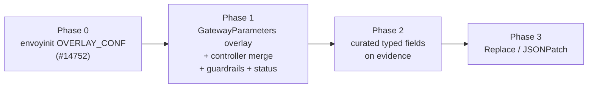
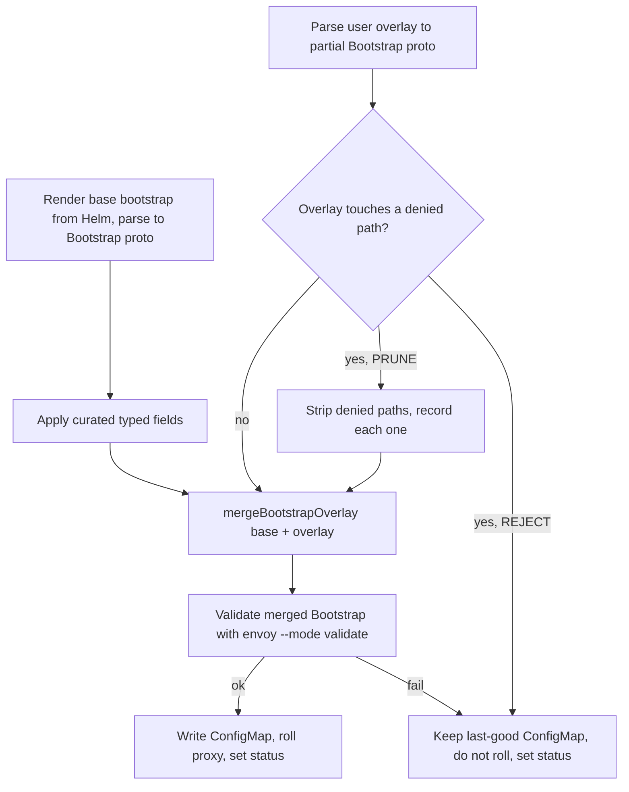

# EP-13666: Mutable Envoy bootstrap config for managed gateway proxies

- Issue: [#13666](https://github.com/kgateway-dev/kgateway/issues/13666)
- Phase 0 implementation: [#14752](https://github.com/kgateway-dev/kgateway/pull/14752)

## Background

For a managed gateway proxy, kgateway's deployer generates the Envoy bootstrap
(`envoy.yaml`) from an internal Helm template, stores it in a `ConfigMap` named
after the `Gateway`, and mounts it into the proxy `Pod` at `/etc/envoy` via a
volume named `envoy-config`. The `envoy-wrapper` (envoyinit) reads that file and
feeds it to Envoy as the whole bootstrap.

`GatewayParameters.spec.kube.envoyContainer.bootstrap` exposes only a handful of
curated knobs today (`logLevel`, `componentLogLevels`, `logFormat`,
`dnsResolver.udpMaxQueries`, `enableReadinessProbeProxyProtocol`). Anything else
in the bootstrap — **Envoy reloadable feature flags**
(`envoy.reloadable_features.*`), `stats_config.histogram_bucket_settings`
([#14088](https://github.com/kgateway-dev/kgateway/issues/14088)),
`stats_flush_interval`, extra runtime layers, alternate DNS resolver settings, custom
static clusters — is not reachable through the API.

The concrete motivating case (this issue, #13666) is reloadable feature flags. When
an Envoy upgrade changes behavior, Envoy ships a `envoy.reloadable_features.<name>`
flag so operators can roll the behavior back temporarily while they adapt; the flag
is later removed once the new behavior is settled. Those flags live in the bootstrap
(as a `layered_runtime` layer), so today a kgateway user has no supported way to set
one. The issue explicitly asks that this be solved **generically — a way to alter
the bootstrap, not a reloadable-feature-specific knob** — which is the shape this EP
takes.

The current answer is a workaround: copy the generated bootstrap into a custom
`ConfigMap`, add the desired config, and repoint the `envoy-config` volume at it
using a `deploymentOverlay` (`spec.kube.deploymentOverlay`). This works, but it
forces the user to own a **complete, verbatim copy** of the generated bootstrap,
including control-plane–managed fields (`node.cluster`, `node.metadata.role`, the
`xds_cluster`, the xDS JWT credential config, `dynamic_resources`).

### Relevant sources

- Bootstrap template: `pkg/kgateway/helm/envoy/templates/configmap.yaml`
- Wrapper that loads, transforms, and re-marshals the bootstrap proto:
  `pkg/envoyinit/run.go`
- Phase 0 merge: `pkg/envoyinit/overlay.go` (`mergeBootstrapOverlay`, #14752)
- API types: `api/v1alpha1/kgateway/gateway_parameters_types.go` (`EnvoyBootstrap`)
- Controller settings: `api/settings/settings.go`
- Overlay precedent (strategic merge patch with `$patch` directives):
  `api/v1alpha1/shared/overlay_types.go` (`KubernetesResourceOverlay`)

## Motivation

The workaround is fragile in exactly the way an API should not be. The moment
kgateway changes its bootstrap template in a future version — a new xDS field, a
new static listener, a renamed cluster, a new managed filter — the user's copied
`ConfigMap` silently drifts from the generated format. There is no merge, no
validation, and no warning; the user must manually re-reconcile their copy on every
upgrade, and a stale copy can break xDS connectivity or crash-loop the proxy.

We want a way to mutate the bootstrap that:

1. lets the user express **only their delta**, not a full copy, and
2. **continues to apply correctly when the base bootstrap meaningfully changes**
   in a future version, because untouched fields flow through automatically.

## Goals

- **Phase 0:** unblock #13666 now with a small, unsupported-but-documented
  mechanism: envoyinit merges a user-supplied partial bootstrap over the generated
  one (#14752).
- **Phase 1:** provide a `GatewayParameters` API to mutate the managed proxy's Envoy
  bootstrap without copying the whole document, applied as a **structured patch
  against the Envoy `Bootstrap` proto after the base bootstrap is generated**, so the
  base can evolve across versions without breaking user config.
- Ensure a user's value for a control-plane–managed field **never reaches the
  bootstrap**, so a stale patch can never break xDS connectivity after an upgrade —
  and do so without letting one such field take the rest of the patch down with it.
- Let the operator choose, with a controller setting, whether a patch that touches a
  managed field is pruned (default) or rejected.
- Validate the merged bootstrap before rollout and report results on the `Gateway`'s
  status, rather than crash-looping Envoy.
- Satisfy [#14088](https://github.com/kgateway-dev/kgateway/issues/14088)
  (`stats_config.histogram_bucket_settings`): expressible through the overlay in
  Phases 0 and 1, and promoted to a curated, validated field in Phase 2.

## Non-Goals

- Replacing the existing `deploymentOverlay` mechanism. It remains the escape hatch
  for `Deployment`-level changes (volumes, sidecars, etc.); this EP is specifically
  about bootstrap *content*.
- Mutating dynamic (xDS-delivered) config such as listeners, routes, and clusters.
  Those are owned by the translation pipeline and configured via Gateway API and
  policy CRDs.
- Letting users override control-plane–managed bootstrap fields through the Phase 1
  API (the xDS cluster, node identity, ADS config, admin address). Those values are
  never honored there. Phase 0 deliberately does not protect them (see Phase 0).
- Arbitrary text/templating of the bootstrap document (see Alternatives).
- An admission webhook (see Write-time feedback).

## Implementation Details

### Design principle

Apply mutations as a **proto-level patch onto the freshly generated `Bootstrap`** —
never as a textual or whole-document replacement. This is the same layering Envoy
itself uses (`--config-path` + `--config-yaml`, which is a proto `MergeFrom`).
Because the patch targets stable proto field paths rather than line/character
positions, it keeps working when the surrounding base config changes.

### Phasing



- **Phase 0 — envoyinit overlay (#14752).** Ships the merge function and a way to
  use it today, with no API change and no guardrails.
- **Phase 1 — API, controller-side merge, guardrails, status (the supported MVP).**
  Reuses the Phase 0 merge function in the controller and adds the managed-field
  guardrail, merged-result validation, status reporting, and automatic rollout.
- **Phase 2 — promote curated fields on evidence.** Start generic, curate when a
  given overlay shape recurs.
- **Phase 3 — removal/replace strategies.** Only once a concrete need for
  non-additive edits appears.

Layer 2 of the Phase 1 API (the overlay) is strictly more general than Layer 1
(curated fields): anything a curated field does, the overlay can already express. So
we ship the overlay first and curate later.

### Phase 0: envoyinit overlay

PR #14752 teaches envoyinit to read an optional partial bootstrap from the file named
by the `OVERLAY_CONF` environment variable on the proxy container, merge it over the
kgateway-generated bootstrap with `mergeBootstrapOverlay`, and hand the result to
Envoy. It needs no API change: the existing `podTemplate.extraVolumes`,
`envoyContainer.extraVolumeMounts`, and `envoyContainer.env` fields deliver the file
and the variable.

```yaml
apiVersion: v1
kind: ConfigMap
metadata:
  name: my-gateway-bootstrap-overlay
data:
  overlay.yaml: |
    layered_runtime:
      layers:
      - name: user_runtime
        static_layer:
          envoy.reloadable_features.no_extension_lookup_by_name: false
---
apiVersion: gateway.kgateway.dev/v1alpha1
kind: GatewayParameters
metadata:
  name: my-gateway
spec:
  kube:
    podTemplate:
      extraVolumes:
      - name: bootstrap-overlay
        configMap:
          name: my-gateway-bootstrap-overlay
    envoyContainer:
      extraVolumeMounts:
      - name: bootstrap-overlay
        mountPath: /etc/envoy-overlay
        readOnly: true
      env:
      - name: OVERLAY_CONF
        value: /etc/envoy-overlay/overlay.yaml
```

Semantics (`pkg/envoyinit/overlay.go`, verified against a running proxy by
`pkg/envoyinit/overlay_envoy_test.go`):

- **The overlay wins conflicts.** Set scalars replace kgateway's values, messages
  merge recursively, and repeated fields append (proto `Merge`). The overlay cannot
  reset a field to its zero value.
- **Runtime layers go before `admin_layer`**, not after it, so `/runtime_modify`
  keeps winning (see Merge semantics). A user layer whose name duplicates a base layer
  is an error.
- **A bad overlay stops the proxy.** An unreadable file, an unknown field, or a
  duplicate layer name makes envoyinit exit before starting Envoy; a merged bootstrap
  Envoy rejects fails at Envoy startup. With a rolling update the old pods normally
  keep serving and the rollout stalls, but the only signal is pod status and logs.

What Phase 0 deliberately does **not** provide, and why it is documented as "you
own the upgrade consequences":

- **No managed-field protection.** An overlay can override `node`, the admin
  address, or anything else. This matches the existing posture of `ExtraArgs`
  (documented, not enforced). In the upgrade scenario described under Guardrails —
  kgateway N+1 starts managing a field the user set under N — a Phase 0 override
  keeps winning silently.
- **No validation before rollout and no status.**
- **No rollout on overlay edits.** envoyinit reads the file once at startup, so a
  `ConfigMap` edit has no effect until pods restart, and pods can disagree until then.

Phase 0 is the escape hatch by design, and stays one:

- **Phase 0 does not honor the denylist.** It is the one documented way to override a
  control-plane–managed field, for users who need to and accept the consequences.
  `KGW_BOOTSTRAP_PATCH_DENIED_PATHS` does not reach envoyinit.
- **Phase 0 is not deprecated when Phase 1 ships.** It remains the advanced escape
  hatch. Because envoyinit applies it last, a Phase 0 overlay is merged over the
  Phase 1 result and **bypasses Phase 1's guardrails**; the docs for both phases must
  say so.

### Phase 1: API, controller merge, guardrails

#### Configuration

Extend `EnvoyBootstrap` in `api/v1alpha1/kgateway/gateway_parameters_types.go` with
a `patches` field, structured in two layers. Phase 1 ships Layer 2 only; Layer 1
fields arrive in Phase 2.

```yaml
apiVersion: gateway.kgateway.dev/v1alpha1
kind: GatewayParameters
metadata:
  name: my-gateway
spec:
  kube:
    envoyContainer:
      bootstrap:
        patches:
          # Layer 1 (Phase 2): curated, strongly-typed fields for common cases.
          statsConfig:
            histogramBucketSettings:
              - match: { prefix: "cluster." }
                buckets: [1, 5, 10, 25, 50, 100, 250, 500, 1000, 2500, 5000, 10000]

          # Layer 2 (Phase 1): typed proto-merge escape hatch for everything else.
          overlay:
            mergeStrategy: StructuredMerge   # default, and the only value in Phase 1
            value:                           # a partial envoy.config.bootstrap.v3.Bootstrap
              stats_flush_interval: 10s
              layered_runtime:
                layers:
                  - name: user_runtime
                    static_layer:
                      envoy.reloadable_features.no_extension_lookup_by_name: false
```

1. **Curated typed fields** (`statsConfig.histogramBucketSettings`,
   `statsFlushInterval`, `dnsResolver`, ...). These give CRD validation,
   documentation, and a stable contract. Issue #14088 is the first candidate for
   promotion (Phase 2); until then it goes through the overlay.
2. **A typed proto overlay** (`overlay.value`), stored with
   `+kubebuilder:pruning:PreserveUnknownFields` and parsed by the controller as a
   *partial* `envoy.config.bootstrap.v3.Bootstrap`. The API server does not validate
   under `PreserveUnknownFields`, so typos and bad types are caught by the controller
   and reported on status. Because it is keyed by proto field, it survives
   base-template changes.

#### Worked example: reloadable feature flags

There is **no flat "reloadable features" field** in the Envoy bootstrap — a feature
flag like `envoy.reloadable_features.<name>` is just a runtime key, set through
`layered_runtime.layers[].static_layer` as shown above.

- The generated base bootstrap **already defines** a `layered_runtime` with two
  layers — `static_layer` (holding e.g.
  `envoy.restart_features.use_eds_cache_for_ads: true`) and `admin_layer`
  (`pkg/kgateway/helm/envoy/templates/configmap.yaml`).
- Envoy resolves each runtime key from the last layer that sets it, and the
  `admin_layer` must stay last so `/runtime_modify` keeps overriding everything.
  User layers are therefore inserted immediately before the first `admin_layer`,
  giving `static_layer`, then user layers, then `admin_layer`. A user layer
  overrides the managed `static_layer` but not `/runtime_modify`.
- Give the user layer a **distinct `name`** (e.g. `user_runtime`). Envoy rejects
  duplicate layer names (`Duplicate layer name: static_layer`,
  `source/common/runtime/runtime_impl.cc`), and `mergeBootstrapOverlay` rejects them
  earlier with a clearer message. `layered_runtime` is not on the denylist.
- Envoy ignores runtime keys it does not know, so a flag that a later Envoy removes
  never fails validation; it silently stops having an effect. The release notes of
  the Envoy bump, not this mechanism, are the signal for that.

#### Merge semantics

Proto `MergeFrom` is additive: repeated fields append, singular fields overwrite,
messages merge recursively. It cannot *remove* or wholesale-*replace* a repeated
field. We model `mergeStrategy` on the *vocabulary* of the existing
`KubernetesResourceOverlay` (`api/v1alpha1/shared/overlay_types.go`), but this is a
**conceptual** borrow, not a code reuse: that overlay is implemented with Kubernetes
strategic merge patch (`pkg/deployer/strategicpatch/strategicpatch.go`), which
depends on `patchStrategy`/`patchMergeKey` struct tags the Envoy `Bootstrap` proto
does not carry.

- `StructuredMerge` (default; Phase 0 and 1) — `mergeBootstrapOverlay`: proto
  `MergeFrom`, except that `layered_runtime.layers` are inserted before the
  `admin_layer` rather than appended.
- `Replace` (Phase 3) — replace a named sub-message/list wholesale (e.g. fully define
  `stats_config`), using `$patch: replace` semantics.
- `JSONPatch` (Phase 3) — RFC 6902 ops against the bootstrap, for surgical removals.
  This is the one mode whose paths re-couple to base structure, so it is discouraged
  and documented as such.

A user static cluster whose name collides with a managed one cannot silently shadow
it: `StructuredMerge` appends a second cluster of the same name, and Envoy rejects
the bootstrap (`cluster manager: duplicate cluster 'xds_cluster'`,
`source/common/upstream/cluster_manager_impl.cc`). The denylist below turns that
failure for `xds_cluster` into a pruned, reported path.

#### Pipeline

Phase 1 moves the merge from envoyinit into the controller, before the bootstrap
`ConfigMap` is written, so the `ConfigMap` on the cluster is already the final
config and all logic and status reporting live in one place.



Today the deployer does not build a `Bootstrap` proto; it renders the bootstrap as
Helm text. Phase 1 adds a parse / mutate / re-marshal step, the same roundtrip
envoyinit already performs (`pkg/envoyinit/run.go`). The existing `pkg/xds/bootstrap`
`ConfigBuilder` is *not* a drop-in base generator: it synthesizes a bootstrap purely
to validate translated xDS.

#### Guardrails

##### Managed-field denylist

The controller maintains a denylist of proto paths the control plane owns, all
present in the generated bootstrap (`pkg/kgateway/helm/envoy/templates/configmap.yaml`):

- `node`
- `dynamic_resources`
- `admin.address`
- `static_resources.clusters[name=xds_cluster]` (which also carries the xDS JWT
  credential injector)

Paths are matched on the **parsed proto** (field descriptors, with list entries
identified by key), never on raw YAML keys, because the proto JSON mapping accepts
both `dynamic_resources` and `dynamicResources`.

What happens to a patch that touches a denied path is an operator choice, set by a
new controller setting in `api/settings/settings.go`, modeled on `ValidationMode`:

```go
// BootstrapPatchDeniedPaths determines what the controller does with a
// GatewayParameters bootstrap overlay that sets a control-plane-managed path.
// Supported values:
// - "PRUNE" (default): drop each denied path from the overlay before merging,
//   apply the rest, and report each dropped path on status.
// - "REJECT": apply none of the overlay and report the denied paths on status.
BootstrapPatchDeniedPaths BootstrapPatchDeniedPathsMode `split_words:"true" default:"PRUNE"`
```

That is `KGW_BOOTSTRAP_PATCH_DENIED_PATHS=PRUNE|REJECT`.

**`PRUNE` is the default** because it is the only mode that stays safe across an
unattended upgrade. The denylist is small but not fixed forever: if kgateway N+1
starts generating a field that a user set legitimately under N, that path joins the
denylist, and a patch that was valid when written now touches it. There is no way to
keep honoring the override — honoring it *is* the breakage — so a deprecation window
is not available either. The only question is what happens to the rest of the patch.
Under `PRUNE`, the stale path is dropped, kgateway's generated value is used (by
construction the value that works), the user's unrelated entries (such as the
reloadable feature flag they are relying on during that very Envoy bump) still
apply, and the proxy rolls cleanly.

Pruning happens *before* the merge, so the managed fields are protected by
construction: the user's value never enters the merge, and there is no post-hoc
"did it survive?" check to get wrong.

`REJECT` suits operators who would rather have patch authors fix mistakes than have
them silently dropped. It accepts the upgrade hazard above knowingly: on an upgrade
that grows the denylist, the entire overlay stops applying to affected Gateways,
which then follow the invalid-merge fallback. The docs must say this plainly.

The operator (usually a platform team) owns this choice rather than the
`GatewayParameters` author, because the author is the person most tempted to set a
managed field; a per-resource switch would let them opt out of the protection.

This is a **new, enforced** guardrail. The closest analogue, `ExtraArgs`, only
*documents* flags that "must not be set here" and points to `DeploymentOverlay` to
override them. Enforcing here is a deliberate departure justified by the
upgrade-safety goal. Phase 0 keeps the documented posture for users who need to
override a managed field anyway.

##### Denylist growth is a breaking change

Pruning makes denylist growth survivable, not safe: once a field becomes
control-plane-managed, no behavior preserves the user's intent. So:

- The denylist is an **enumerated, effectively frozen set**. A field kgateway merely
  *prefers* to own does not belong on it.
- Adding a path is treated as a breaking change and carries a release-note
  obligation.
- The per-path metric (see Reporting) lets a platform team find affected Gateways
  *before* a version bump.

##### Validate the merged result

Run the combined `Bootstrap` through `envoy --mode validate` before rollout. A
reusable validator exists — `pkg/validator` (binary / docker / caching) — but today
it is wired only into the translator (`proxy_syncer.go` ->
`NewCombinedTranslator(..., validator)`), so reusing it on the bootstrap path is new
wiring. Prefer the binary validator where the Envoy binary is available; the docker
validator is fragile in network-restricted environments. `--mode validate` builds
both the runtime and the cluster manager, so it catches duplicate layer and cluster
names.

##### Invalid-merge fallback

When the overlay cannot be parsed, the merged bootstrap fails validation, or
`REJECT` refuses the overlay, the controller keeps the last-good bootstrap
`ConfigMap`, does not roll the proxy, and sets status. See Open Questions for the
upgrade and first-creation cases.

#### Deployer

- The bootstrap `ConfigMap` rendering gains the pipeline above.
- No new volumes or mounts; the existing `envoy-config` volume carries the merged
  bootstrap.
- A change to `bootstrap.patches` triggers the same reconcile/rollout the deployer
  already performs for other `GatewayParameters` changes.

#### Reporting

Status goes on the **`Gateway`**, not `GatewayParameters`:
`GatewayParametersStatus` is empty today, one `GatewayParameters` can serve many
Gateways, and the merged result is per Gateway.

Add a `BootstrapPatchApplied` condition:

| Status | Reason | When |
| --- | --- | --- |
| `True` | `Applied` | Whole overlay applied. |
| `True` | `PathsIgnored` | `PRUNE` dropped one or more denied paths; the rest applied. The message lists each dropped path. |
| `False` | `PathsDenied` | `REJECT` refused an overlay that touched denied paths. The message lists them. |
| `False` | `InvalidOverlay` | The overlay does not parse as a partial `Bootstrap`. |
| `False` | `ValidationFailed` | The merged bootstrap failed `envoy --mode validate`. |

`True` with `PathsIgnored` is deliberate: the patch did apply, and a routine ignored
path must not read as a broken Gateway to anyone alerting on condition status.
`False` is reserved for cases where the overlay could not be rolled out at all.

Also emit a `Warning` event for each dropped or denied path, and a metric labeled by
path (and Gateway). The denylist is small and enumerable, so cardinality is bounded.

The honest cost of `PRUNE` as default: a fresh mistake is reported rather than
refused, so someone who does not check status can believe a setting took effect when
it did not. The event, the metric, and the optional CEL rules below mitigate it.

#### Write-time feedback

Enforcement stays in the controller, which is the only place that can validate
against the *current* base bootstrap (it changes on upgrade) and run
`envoy --mode validate`. kgateway has no admission webhooks today and this EP does
not add one.

As a convenience, the CRD may add `x-kubernetes-validations` (CEL) rules that
reject denylist paths at write time. CEL sees only the properties a
`PreserveUnknownFields` object declares: a rule naming an undeclared field fails
CRD creation (`compilation failed: undefined field 'node'`), and undeclared fields
are stored but invisible to rules. So each denied path must be declared as a schema
property alongside `PreserveUnknownFields`, in both snake_case and lowerCamelCase.
Keyed list entries work too, by declaring the list with partially typed items
(`type: object`, `PreserveUnknownFields`, and a `name: string` property):

```yaml
x-kubernetes-validations:
- rule: "!has(self.node) && !has(self.dynamic_resources) && !has(self.dynamicResources)"
  message: node and dynamic_resources are managed by kgateway
- rule: >-
    !has(self.static_resources) || !has(self.static_resources.clusters) ||
    !self.static_resources.clusters.exists(c, has(c.name) && c.name == 'xds_cluster')
  message: static cluster xds_cluster is managed by kgateway
```

This was checked against envtest API servers v1.31.0 and v1.35.0. The controller
pins `k8s.io/apiserver` v0.35.3, whose `pkg/cel/common/schemas.go` documents the
same behavior. Declaring properties does not prune anything: an allowed overlay
round-trips with its unknown fields intact. A gap in CEL coverage is never a safety
gap, because the controller enforces regardless.

These rules refuse patches that are illegal *today*, which is the right answer at
write time under either `PRUNE` or `REJECT`.

### Phase 2: curated fields

When a given overlay shape recurs (starting with
`statsConfig.histogramBucketSettings` for #14088), promote it into a strongly-typed
Layer 1 field for CRD validation, documentation, and a stable contract. Promotion is
backward-compatible: the curated field and the overlay target the same proto path,
with the curated field applied first and the overlay layered on top. A curated
`staticResources.clusters` field, if demand warrants, can reject collisions with
managed cluster names up front with a clearer message.

### Phase 3: removal and replace strategies

Add `Replace` and (discouraged) `JSONPatch` once a concrete need for non-additive
edits appears. `StructuredMerge` covers the additive majority. Denied paths apply
equally to these strategies.

### Translator and Proxy Syncer

No changes to xDS translation. This EP only affects the static bootstrap.

### Test Plan

- **Phase 0 (in #14752):** unit tests for `mergeBootstrapOverlay` (layer placement,
  duplicate layer names, scalar/message/list semantics) and `applyOverlayFile`;
  docker tests that run the envoy-wrapper image with the deployer-rendered bootstrap
  and assert, through the admin API, the running runtime layers, precedence,
  `/runtime_modify` still winning, and fail-fast on a bad overlay.
- **Phase 1 unit:** denied-path matching on the parsed proto (snake_case and
  lowerCamelCase, keyed list entries); `PRUNE` strips exactly the denied paths and
  leaves the rest; `REJECT` applies nothing; the settings decoder accepts only
  `PRUNE`/`REJECT`; each status reason.
- **Phase 1 golden:** `GatewayParameters` inputs with overlays produce the expected
  merged bootstrap; a base-bootstrap change does not disturb the user delta
  (regression guard for "survives version change"); an overlay touching a denied path
  under each mode.
- **Phase 1 upgrade regression:** simulate a denylist addition against a stored
  overlay that sets that path plus a runtime layer; under `PRUNE` the runtime layer
  still applies and status is `True`/`PathsIgnored`.
- **Phase 1 e2e:** a new suite (there is no existing `/config_dump`
  `BootstrapConfigDump` assertion in the tree) that applies an overlay and asserts
  the running Envoy's bootstrap, plus a negative case for a denied path surfacing
  `PathsIgnored` (default) and `PathsDenied` (with `REJECT`).

## Alternatives

- **Status quo: clone `ConfigMap` + `deploymentOverlay`.** Works today but requires a
  verbatim full copy of the generated bootstrap and silently drifts on upgrade.
- **Stop at Phase 0.** Solves the headline ask with little code, but leaves managed
  fields unprotected, has no status, and does not roll on edits. Adequate as an
  escape hatch, not as the supported API.
- **`--config-yaml` via `envoyContainer.extraArgs`.** The envoyinit wrapper already
  invokes Envoy with one `--config-yaml <generated bootstrap>`; a second one collides
  (`(--config-yaml) -- Argument already set!`).
- **`-c <overlay>` (`--config-path`) via `envoyContainer.extraArgs`.** Works today
  with no code change. Envoy loads `--config-path` first and merges the wrapper's
  `--config-yaml` over it, so **kgateway's bootstrap wins every conflict** and a stale
  user file can never override a managed field. The flip side: the user cannot
  override anything kgateway sets (e.g. the `static_layer` key
  `envoy.restart_features.use_eds_cache_for_ads`), their runtime layers land *before*
  `static_layer`, and their repeated-field entries come first. It covers adding a
  reloadable-feature flag kgateway does not set, but not overriding one it does.
  Verified in #14752 (`TestEnvoyExtraArgsConfigPathMergesUnderBootstrap`). Like
  Phase 0, it has no validation before rollout, no status, and no rollout on edits.
- **Always reject a patch that touches a denied path.** The original draft of this
  EP. Clearest feedback for fresh mistakes, but an upgrade that grows the denylist
  takes out the user's unrelated, load-bearing entries unattended. Kept as the
  `REJECT` mode rather than the default.
- **Per-`GatewayParameters` prune/reject switch.** Puts the choice with the patch
  author, the person the guardrail protects against. Rejected in favor of the
  controller setting.
- **Allowlist of top-level fields** (`stats_config`, `layered_runtime`,
  `stats_flush_interval`, `typed_dns_resolver_config`, `static_resources.clusters`).
  A typed, pruned schema would let CEL carry real enforcement weight, but it blunts
  the emergency/security-response use case that motivates the EP, and
  controller-side enforcement does not need it.
- **Admission webhook.** Immediate feedback, but a new moving part kgateway does not
  have today, and it still cannot validate against a future base bootstrap. The
  optional CEL rules provide the easy cases without it.
- **A single opaque "full bootstrap replacement" field.** Reintroduces the
  verbatim-copy problem and the managed-field hazard inside the CRD.
- **String templating of the bootstrap.** Text-level patches re-couple to
  line/character structure and break on base changes.

## Open Questions

- **Invalid-merge fallback across an upgrade and on first creation.** "Keep last-good
  `ConfigMap`, do not roll" is well defined for an edit to an existing Gateway. After
  a kgateway upgrade, last-good was rendered by the previous version; keeping it means
  running an old bootstrap under the new control plane, and holding the `Deployment`
  too blocks that Gateway's upgrade. A new Gateway has no last-good at all. The
  alternative is failing open (roll the generated bootstrap without the overlay and
  set `False`), which proceeds but drops load-bearing settings. Which applies in each
  case?
- **CEL coverage.** Every current denylist path, including the keyed
  `static_resources.clusters[name=xds_cluster]`, can be expressed (see Write-time
  feedback). Should the schema cover all of them, or only the top-level ones? Each
  declared path is one more place a denylist change must be mirrored.
