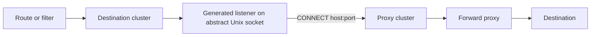

# EP-14789: HTTP CONNECT Tunnels for Backends

- Issue: [#14789](https://github.com/kgateway-dev/kgateway/issues/14789)

## Background

Some environments allow outbound traffic only through an HTTP forward proxy.
kgateway cannot send upstream connections through such a proxy, so Backends
outside the network are unreachable.

Envoy's TCP proxy filter can open HTTP CONNECT tunnels. Previously this was exposed on
Upstream API by pointing the destination cluster at a generated listener on an
abstract Unix socket, whose TCP proxy opens the tunnel.
This EP brings that design to kgateway's Backend and BackendConfigPolicy model.

## Motivation

Configuring the tunnel on the backend, not on routes, sends every user of the
backend's cluster through the proxy.

## Goals

- Tunnel a Backend's connections through an existing HTTP CONNECT proxy,
  configured with BackendConfigPolicy.
- Keep TLS to the destination end to end, and allow separate TLS to the proxy.
- Support preemptive proxy authentication with CONNECT headers set inline or from
  a Secret.
- Let the proxy resolve the destination's hostname.
- Fail closed: an invalid or unreachable tunnel never falls back to a direct
  connection.
- Keep credentials out of status, logs, and debug endpoints.

## Non-Goals

- Deploying the proxy, or configuring egress for other processes.
- Gateway-wide `HTTP_PROXY`, `HTTPS_PROXY`, or `NO_PROXY` settings.
- Chained proxies, dynamic destinations, POST-based tunneling, and
  challenge-response proxy authentication.
- agentgateway.

## Implementation Details

### Architecture



The destination cluster keeps its name, protocol, and TLS settings, so its
consumers are unchanged; only its endpoint becomes the abstract socket. The
generated listener's TCP proxy opens the tunnel through the proxy's existing
cluster, which keeps its own endpoints, protocol, TLS, and policies. Destination
TLS passes through the tunnel as opaque bytes. Envoy resolves only the proxy.

### Configuration

New field `BackendConfigPolicy.spec.tunnel`:

| Field | Description |
|---|---|
| `tunnel.proxy.backendRef` | Required. The proxy Service (with a port) or Static Backend. A reference to another namespace requires a ReferenceGrant there. |
| `tunnel.headers` | Optional. Up to 16 shared `HTTPHeader`s added to the CONNECT request, each with a `name` and exactly one of `value` or `secretRef`. `Host` cannot be set. |

CEL requires a policy with `tunnel` to use `targetRefs` to Backends.

```yaml
apiVersion: gateway.kgateway.dev/v1alpha1
kind: Backend
metadata:
  name: api
spec:
  type: Static
  static:
    hosts:
    - host: api.example.com
      port: 443
---
apiVersion: gateway.kgateway.dev/v1alpha1
kind: BackendConfigPolicy
metadata:
  name: api-egress
spec:
  targetRefs:
  - group: gateway.kgateway.dev
    kind: Backend
    name: api
  tls:
    sni: api.example.com
    wellKnownCACertificates: System
  tunnel:
    proxy:
      backendRef:
        name: egress-proxy
        port: 3128
    headers:
    - name: Proxy-Authorization
      secretRef:
        name: egress-proxy-credentials
        key: authorization
```

- Destination TLS stays on the destination's policy. Proxy TLS goes on a policy
  attached to the proxy backend, so a shared proxy cluster has one TLS setting.
- CONNECT uses the proxy cluster's HTTP protocol, HTTP/1.1 or HTTP/2.
- Tunnel settings merge as one unit under existing BackendConfigPolicy precedence.
- Header values drop one terminal LF or CRLF and trim surrounding spaces and tabs,
  as Secret files often end with a newline. Empty values, CR, LF, NUL, invalid
  UTF-8, and values over 16 KiB are rejected; `%` is escaped for Envoy's
  formatter. This runs on every Secret update, and errors name the header, never
  the value.

### Plugin

A new plugin SDK hook, `ProcessBaseClusterResources`, works like
`ProcessBaseCluster` but can return listeners delivered with the cluster, or fail
the backend. These hooks run after all `ProcessBaseCluster` hooks, in
(Group, Kind) order.

BackendConfigPolicy's hook:

1. Takes the effective tunnel from the backend's merged policies.
2. Resolves the proxy. It must be authorized, be a Service or a Static Backend,
   and not be tunneled itself.
3. Rejects destination settings that cannot work over a Unix socket: TCP
   keepalive, socket options or source address, upstream PROXY protocol, and
   active health checks.
4. Rewrites the destination cluster to `STATIC` with one pipe endpoint,
   `@connect_tunnel_<hash>`, whose `hostname` is the destination host, for
   `autoHostRewrite`. The hash is FNV-64a of the cluster name, so the name is
   stable across credential changes.
5. Returns a listener on that socket whose TCP proxy has a `tunneling_config`
   with the destination `host:port` and the CONNECT headers, and points at the
   proxy cluster.

```yaml
# Destination cluster
name: backend_default_api_0
type: STATIC
load_assignment:
  endpoints:
  - lb_endpoints:
    - endpoint:
        hostname: api.example.com
        address: {pipe: {path: "@connect_tunnel_4f73a2c1d09e8b65"}}
---
# Generated listener
name: connect_tunnel_4f73a2c1d09e8b65
address: {pipe: {path: "@connect_tunnel_4f73a2c1d09e8b65"}}
filter_chains:
- filters:
  - name: envoy.filters.network.tcp_proxy
    typed_config:
      "@type": type.googleapis.com/envoy.extensions.filters.network.tcp_proxy.v3.TcpProxy
      stat_prefix: connect_tunnel_4f73a2c1d09e8b65
      cluster: kube_default_egress-proxy_3128
      tunneling_config:
        hostname: api.example.com:443
        headers_to_add:
        - header: {key: Proxy-Authorization, value: "<secret value>"}
```

### Translator and Proxy Syncer

Generated listeners travel with their cluster on the shared base row and the
per-client rows, and are merged into each client's LDS. Every client that
receives the cluster receives its listener. The listeners take part in row
equality and the snapshot version, so a credential-only change pushes new LDS.

An errored backend withdraws both the cluster and the listener, so traffic fails
instead of going direct. Removing the tunnel restores the ordinary cluster;
deleting the Backend removes both.

In strict validation mode, generated listeners are validated with credentials
redacted, because Envoy's errors quote the rejected configuration.

### Reporting

Hook errors are attributed to the tunnel's policy, so both the Backend and the
BackendConfigPolicy report `Accepted=False`. For example, with a proxy in another
namespace and no ReferenceGrant:

```yaml
status:
  conditions:
  - type: Accepted
    status: "False"
    reason: Invalid
    message: 'Backend error: "gateway.kgateway.dev/BackendConfigPolicy/default/api-egress: tunnel proxy egress/egress-proxy: missing reference grant"'
```

Runtime failures, such as a `407` from the proxy or an unreachable proxy, fail
the connection and are not reported in status.

### Security

As with other inline backend credentials, CONNECT headers are part of the
generated listener's LDS configuration, and every Gateway of the controller
receives every tunnel. kgateway redacts them from `/snapshots/xds`,
`/snapshots/krt`, and strict-validation errors. Redacting `/snapshots/krt`
covers the policy's inline values and its
`kubectl.kubernetes.io/last-applied-configuration` annotation.

New connections use rotated credentials; existing tunnels drain normally.

### Test Plan

- Unit tests:
  - header resolution and normalization;
  - IR equality, where a rotated credential changes the IR;
  - error attribution and policy status;
  - listener lifecycle (valid, invalid, rotated, detached, deleted) and LDS merge;
  - redaction in `/snapshots/xds` and `/snapshots/krt`.
- Translator tests in strict mode:
  - Service and Backend proxies, with destination and proxy TLS;
  - rejection of an unsupported destination, a missing ReferenceGrant, and a
    missing proxy.
- CEL tests: valid policies, and rejection of `targetSelectors` and Service targets.
- e2e tests:
  - HTTP and HTTPS destinations through an authenticating CONNECT proxy;
  - a wrong credential (`407`) and an unavailable proxy, which fail with `503`
    and never fall back to a direct connection.

## Alternatives

| Approach | Reason not chosen |
|---|---|
| A field on Backend, or a dedicated egress CRD | Adds connection settings to Backend, or another attachment model. BackendConfigPolicy already holds backend connection settings. |
| Route or Gateway traffic policy | Does not cover filters that call a cluster directly. |
| Envoy internal listener instead of a Unix socket | [Main-thread clients](https://github.com/envoyproxy/envoy/blob/v1.39.1/source/extensions/bootstrap/internal_listener/client_connection_factory.cc) cannot connect to internal listeners. |
| `http_11_proxy` transport socket | No configurable CONNECT headers and no proxy TLS. |

## Open Questions

- Should tunnels and their credentials go only to the Gateways that use them? Today
  every Gateway receives every tunnel, like other backend clusters.
- HTTP/2 CONNECT is verified manually, e2e setup currently does not support HTTP/2.
