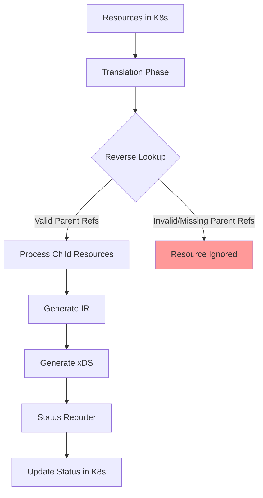
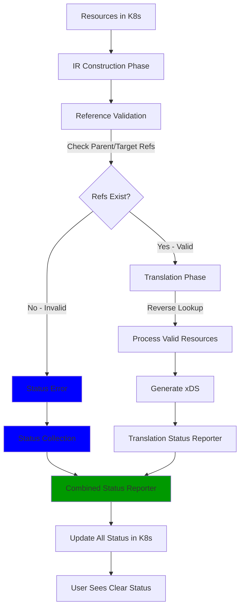

# EP-XXXX: Orphaned Resource Status Reporting

* Issue: [#XXXX](https://github.com/kgateway-dev/kgateway/issues/XXXX)

## Background

Currently, status updates for Kgateway CRDs (HTTPRoutes, TrafficPolicies, etc.) are only reported at the end
of translation phase. Resources are processed through a reverse lookup mechanism where parent resources trigger
the discovery and processing of child resources. This approach works well for correctly configured resources but
fails for "orphaned" resources—resources that reference non-existent or invalid parent/target references.

When a resource is orphaned (e.g., an HTTPRoute with all invalid `parentRefs`, or a TrafficPolicy with all
invalid `targetRefs`), it is never picked up during translation. As a result, no status is reported for these
resources. Users can technically detect orphaned resources by observing a mismatch between `observedGeneration`
and the current generation in the status, but this requires subtle prior knowledge of Kubernetes status
semantics and is not the best user experience.

This problem affects user experience in several ways:
- Users cannot easily distinguish between configuration errors and pending controller operations
- Troubleshooting becomes difficult without clear status feedback
- The behavior deviates from Kubernetes best practices

## Motivation

Providing clear, actionable status feedback for orphaned resources

Other Kubernetes controllers provide clear status feedback for orphaned or misconfigured resources:

- **Cilium** reports status on HTTPRoutes with invalid parent references
  ([docs](https://docs.cilium.io/en/stable/network/servicemesh/gateway-api/gateway-api/))
- **Cert-manager** validates and reports status on Issuer and Secret references
  ([docs](https://cert-manager.io/docs/troubleshooting/))
- **Istio** provides detailed validation messages for VirtualServices with invalid references
  ([docs](https://istio.io/latest/docs/reference/config/analysis/ist0101/))

### Goals

- Report clear, actionable status conditions for resources with invalid or non-existent references
- Maintain consistency with existing status reporting patterns
- Handle partial validity scenarios (some refs valid, some invalid) correctly
- Align with Gateway API and Kubernetes ecosystem best practices
- Minimize performance overhead of reference validation

### Non-Goals

- Change the core translation mechanism or reverse lookup approach
- Implement "pending" states that might confuse transient controller operations with user errors
- Add validation beyond reference existence (deeper semantic validation remains in the translator)
- Modify the status syncer architecture significantly

## Implementation Details

### High-Level Design

The solution introduces **early reference validation** during the initial intermediate representation (IR)
construction phase, before the main translation phase. This validation checks whether referenced resources
actually exist and reports errors immediately, ensuring orphaned resources receive status updates.

#### Current Flow (Problem)



#### Proposed Flow (Solution)



### Implementation Approach

The solution leverages the existing `ReportMap` infrastructure and introduces reference validation during IR
construction phase using a status collection pattern. This approach is consistent with agentgateway status
reporting and minimizes changes to existing code while ensuring orphaned resources receive appropriate status
updates.

#### 1. Reference Validation at IR Construction Phase

During the IR construction phase (when building intermediate representation from CRDs), validate references and
populate a status collection for invalid refs:

**For HTTPRoute:**
- Iterate through each `parentRef` in `spec.parentRefs`
- Check if referenced resource exists (using collection FetchOne)
- For each **invalid** reference, add a status entry to the HTTPRoute status collection
- Routes with at least one valid reference proceed to translation
- Routes with all invalid references are fully orphaned (status collection only, no translation)

**For TrafficPolicy:**
- Iterate through each `targetRef` in `spec.targetRefs`  
- Check if referenced resource exists (using collection FetchOne)
- For each **invalid** reference, add a status entry to the TrafficPolicy status collection
- Policies with at least one valid reference proceed to translation
- Handle ancestor status reporting for multi-section targets

**For other CRDs with references:**
- Apply similar validation during IR construction
- Populate respective status collections for invalid references

#### 2. Status Collection Pattern

Each resource type has its own status collection that captures validation errors:

```go
// Status collection for HTTPRoutes (created during IR construction)
httpRouteStatusCollection, irCollection := krt.NewStatusCollection(
    func(ctx krt.HandlerContext, route *gwv1.HTTPRoute) *gwv1.RouteStatus {
        status := &gwv1.RouteStatus{}
        
        // Validate each parentRef
        for _, parentRef := range route.Spec.ParentRefs {
            if !resourceExists(ctx, parentRef) {
                // Add status for invalid ref
                status.Parents = append(status.Parents, gwv1.RouteParentStatus{
                    ParentRef: parentRef,
                    Conditions: []metav1.Condition{{
                        Type:    "Accepted",
                        Status:  metav1.ConditionFalse,
                        Reason:  "InvalidParentRef",
                        Message: fmt.Sprintf("Parent reference %s not found", parentRef.Name),
                    }},
                })
            }
        }
        
        return status
    },
)
```

**Key characteristics:**
- Status collection only contains entries for **invalid** references
- Valid references are **not** in the status collection
- Valid references proceed to translation and populate the ReportMap (existing behavior)

#### 3. Status Merging

At the end of translation, merge status collection entries into the existing ReportMap:

**Merging Logic**:
1. If resource **only** in status collection → fully orphaned (all refs invalid)
2. If resource **only** in ReportMap → normal path (all refs valid and translated)
3. If resource in **both** → partially orphaned:
   - Status collection has conditions for invalid refs
   - ReportMap has conditions for valid refs that were translated
   - Merge both to create complete status

Merge will be specific to each resource, and following agentgateway's pattern, each resource will register themselves
and corresponding merging function to the status syncer. Status syncer will be added with calling all registered merge
functions. 

#### 4. Concrete Example: Partially Orphaned HTTPRoute

Consider an HTTPRoute with two parent refs:

```yaml
apiVersion: gateway.networking.k8s.io/v1
kind: HTTPRoute
metadata:
  name: my-route
  namespace: default
spec:
  parentRefs:
  - name: valid-gateway      # exists
  - name: missing-gateway    # does NOT exist
  rules:
  - matches:
    - path: {type: PathPrefix, value: /app}
    backendRefs:
    - name: my-service
      port: 80
```

**Processing Flow:**

1. **IR Construction Phase**:
   - Check `valid-gateway`: exists ✓
   - Check `missing-gateway`: does NOT exist ✗
   - Create status collection entry for invalid ref:
     ```go
     httpRouteStatusCollection["default/my-route"] = {
         Parents: [{
             ParentRef: {Name: "missing-gateway"},
             Conditions: [{
                 Type: "Accepted",
                 Status: "False",
                 Reason: "InvalidParentRef",
                 Message: "Gateway missing-gateway not found"
             }]
         }]
     }
     ```

2. **Translation Phase**:
   - Only `valid-gateway` ref processed (reverse lookup)
   - Creates ReportMap entry:
     ```go
     reportMap.HTTPRoutes["default/my-route"].Parents["valid-gateway"] = {
         Conditions: [{
             Type: "Accepted",
             Status: "True",
             Reason: "Accepted"
         }, {
             Type: "ResolvedRefs", 
             Status: "True"
         }]
     }
     ```

3. **Merge Phase**:
   - Merge status collection into ReportMap
   - Final status has TWO parent status entries:
     - `valid-gateway`: Accepted=True, ResolvedRefs=True (from ReportMap)
     - `missing-gateway`: Accepted=False (from status collection)

4. **User sees**:
   ```yaml
   status:
     parents:
     - parentRef: {name: valid-gateway}
       conditions:
       - type: Accepted
         status: "True"
       - type: ResolvedRefs
         status: "True"
     - parentRef: {name: missing-gateway}
       conditions:
       - type: Accepted
         status: "False"
         reason: InvalidParentRef
         message: "Gateway missing-gateway not found"
   ```

### Status Condition Format

Following Gateway API conventions:

**For Invalid References:**
```yaml
status:
  conditions:
  - type: Accepted
    status: "False"
    reason: InvalidParentRef
    message: "Parent reference default/non-existent-gateway not found"
```

**For Partial Validity:**
```yaml
status:
  parents:
  - parentRef:
      name: valid-gateway
    conditions:
    - type: Accepted
      status: "True"
      reason: Accepted
  - parentRef:
      name: invalid-gateway
    conditions:
    - type: Accepted
      status: "False"
      reason: InvalidParentRef
      message: "Gateway invalid-gateway not found"
```

### Performance Considerations

- Reference validation is a simple collection FetchOne
- No additional API calls to Kubernetes
- Validation uses existing collections

### Integration with Existing Systems

The proposed solution maintains compatibility with:
- **AgentGateway status reporting pattern**: Similar status collection approach
- **Translation reporter**: Existing translation status reporting unchanged

### Test Plan

TBD

## Alternatives

### Alternative 1: Fill Missing Status at End of Translation

**Approach:** At the end of translation, iterate through all resources and fill in "Invalid" status for any
references not already reported.

**Pros:**
- Works well for HTTPRoute (1 parentRef → 1 parent condition)
- Minimal changes to existing translation flow

**Cons:**
- Doesn't work for TrafficPolicy (1 targetRef → multiple ancestor conditions)
- Requires complex deduplication logic
- Need to filter policies and check existence in reporter map
- Higher overhead due to post-processing all policies

### Alternative 2: Pending State

**Approach:** Introduce a "Pending" status state for resources being processed but not reported at the end.

**Pros:**
- Explicitly shows resource status for orphaned resources

**Cons:**
- Users cannot distinguish between controller operations and configuration errors

### Alternative 3: Mark Orphaned / Invalid Only

**Approach:** Simply mark resources as "orphaned" or "invalid" without detailed reference validation.

**Pros:**
- Simple implementation
- Low overhead

**Cons:**
- Doesn't help with partial validity scenarios
- Missing/stale status for individual invalid references
- Less actionable for users
- Doesn't align with Gateway API granular status reporting

## Open Questions

1. **Cross-controller references**: How should we handle references to Gateways owned by other controllers?
   - **Proposed**: Check for `gateway.spec.gatewayClassName` and skip validation if owned by a different
     controller
