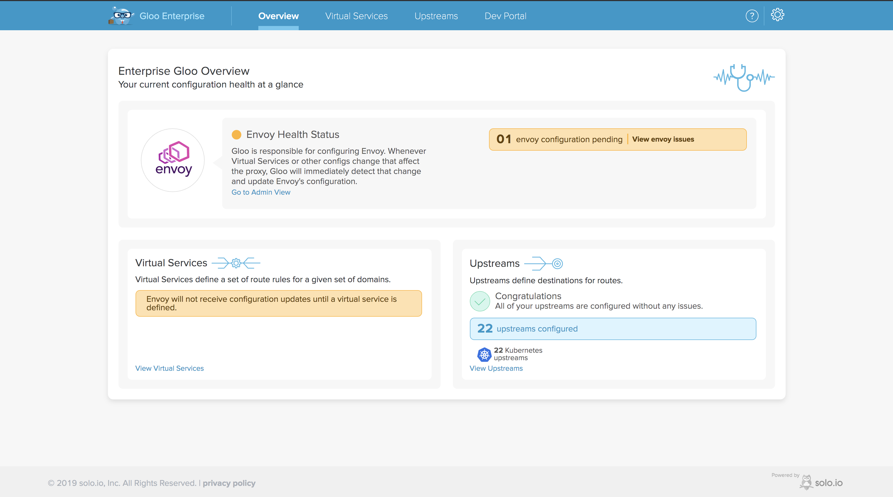
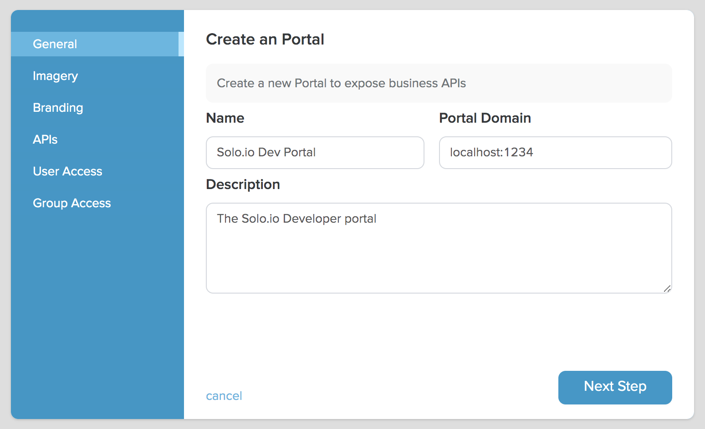
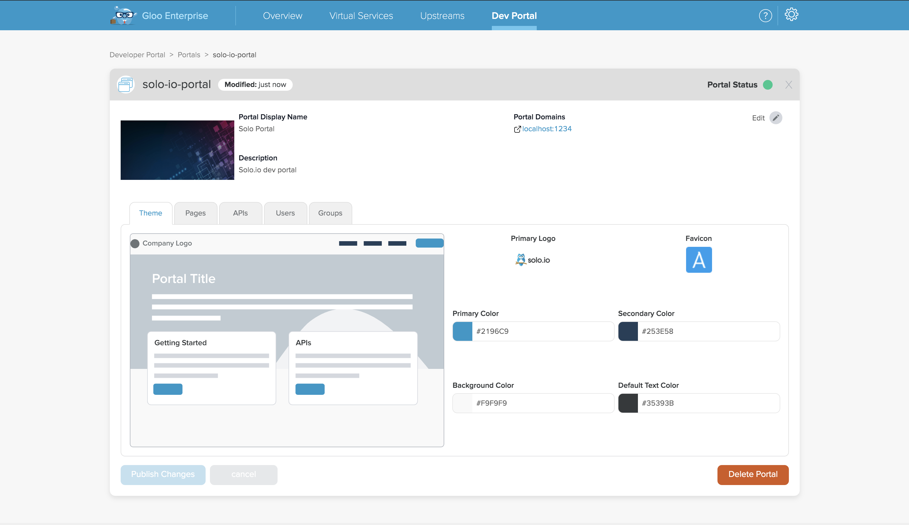
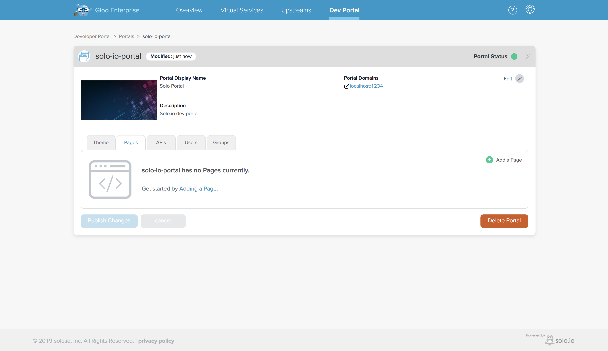
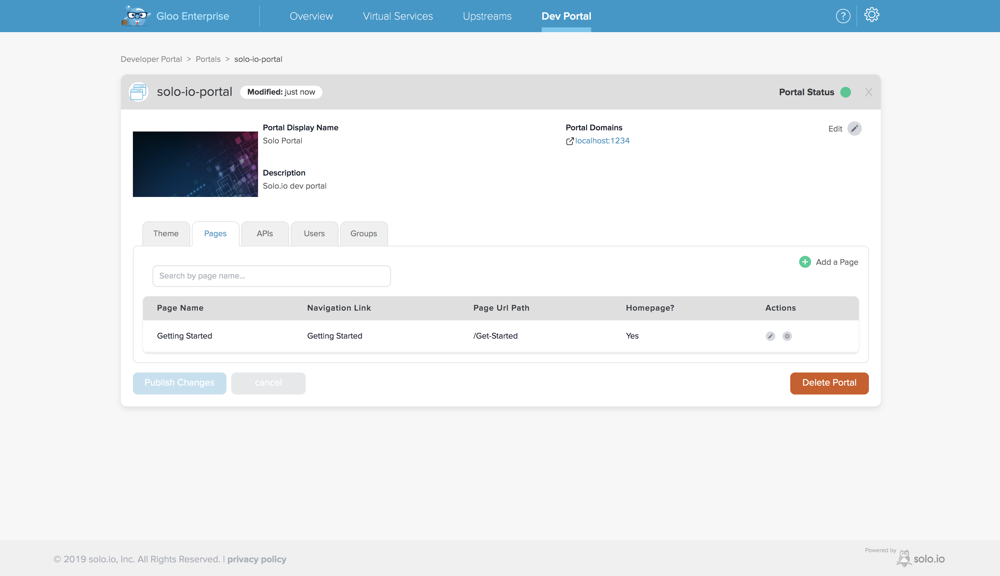
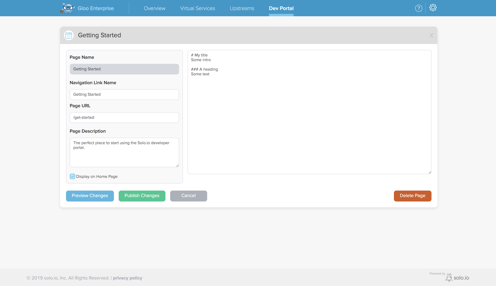
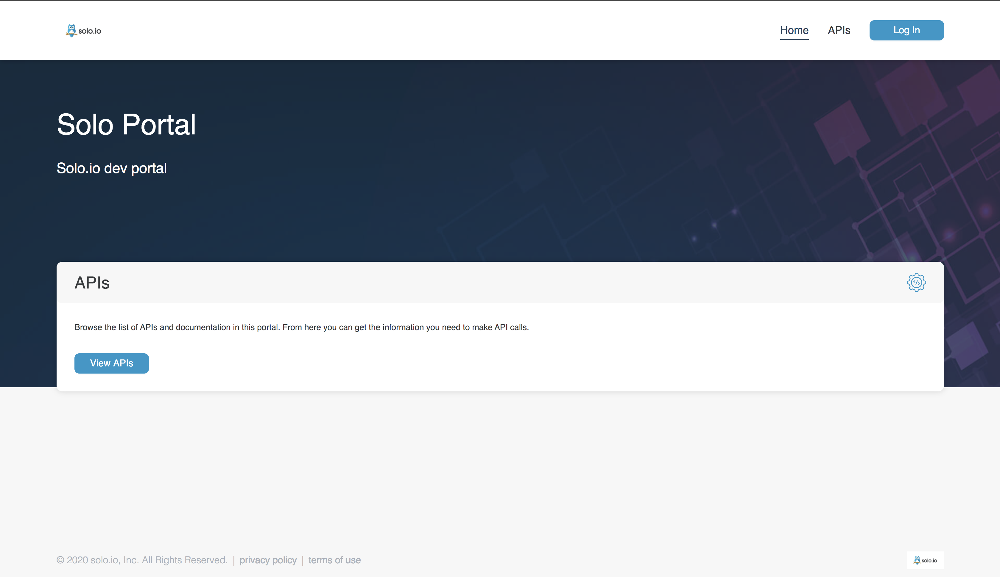
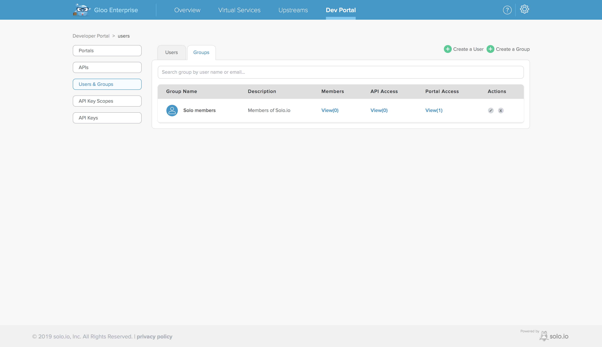

// 

TODO: page index


{}
The developer portal feature was introduced with **Gloo Enterprise**, release v1.3.0. If you are using an 
earlier version, this feature will not be available.
{}

## Intro


# Getting started

## Concepts
// TODO: explain CRDs and general working of the dev portal components

## Installation
The Gloo Developer Portal can be installed as part of Gloo Enterprise by providing an additional `devPortal=true` Helm 
value during your installation or upgrade process. Please refer to the Gloo Enterprise [installation guide](https://docs.solo.io/gloo/latest/installation/enterprise/) 
for more details on the various installation options.

To install Gloo Enterprise with the Developer Portal you can run:

```yaml
helm install glooe glooe/gloo-ee --namespace gloo-system \
  --set-string license_key=YOUR_LICENSE_KEY \
  --set devPortal.enabled=true
```

If the installation was successful you should see the following when running `kubectl get pods -n gloo-system`:

```
api-server-7bff99588f-r6bjl                            3/3     Running   0          83s
dev-portal-6f5f6899cc-kqtwt                            1/1     Running   0          83s
discovery-6fd479f868-9dxhk                             1/1     Running   0          83s
extauth-6d9b44ccbd-qrjc6                               1/1     Running   0          83s
gateway-5c4c88d85c-5czml                               1/1     Running   0          83s
gateway-proxy-d8758d4d4-l49w9                          1/1     Running   0          83s
gloo-56c69d7d7f-qxvkd                                  1/1     Running   0          83s
glooe-grafana-649b9fc9b4-2rqwd                         1/1     Running   0          83s
glooe-prometheus-kube-state-metrics-866856df4d-rsmz2   1/1     Running   0          83s
glooe-prometheus-server-7f85c5778d-vm88v               2/2     Running   0          83s
observability-df76bd88c-8tcnn                          1/1     Running   0          83s
rate-limit-68958d7bb-h4zmm                             1/1     Running   2          83s
redis-9d9b9955f-bh68s                                  1/1     Running   0          83s
```

Notice the `dev-portal-6f5f6899cc-kqtwt` pod.

## Access the developer portal admin UI
Developer portals can be managed through a the Gloo Enterprise UI. To access the UI run:

```shell 
kubectl port-forward -n gloo-system deployment/api-server 8080
```

If you open your browser and navigate to `localhost:8080`, you should see the Gloo Enterprise UI landing page:


If the developer portal was successfully installed and your license key is valid you should see the "Dev Portal" link 
in the top right corner of the screen. If you click on it, you will see the developer portal overview page. This page 
presents a summary of the main developer portal resources (nothing interesting at this point, since we did not create 
any resources yet).


## Create a portal
Let's start by creating a portal. From the overview page click on the "View Portals" link and then on the 
"Create a Portal" button. This will display the portal creation wizard.

##### General portal info
The first step prompts you to define the basic attributes of your portal:

1. `Name`: this will be title of the portal
2. `Description`: short description text that will be displayed close to the title on the portal
3. `Portal Domain(s)`: these are the domains that are associated with the portal. The developer portal web server will 
decide which portal to server to a user based on the host header contained in the user request. For example, if you are 
planning on serving your portal from `my-portal.example.org`, you will need to include this host name in the portal 
domains. When a user navigates to `my-portal.example.org`, the dev portal web server will verify if any portal is 
associated with that host and, if so, display it.

{}
Portal domains must not overlap. In case multiple portals specify overlapping domains, the developer portal controller 
will reject the most recently updated portal resources, i.e. it will accept the portal that first defined the 
overlapping domain.
{}

We will set the domain to `localhost:1234`, as in this guide we will be port-forwarding the portal server to our local 
machine.



##### Portal banner
The next step will prompt us to upload a "hero" image. This is a large banner that will serve as a background for our 
portal. Static portal assets like images are stored in config maps, so the maximum size is determined the 
[`--max-request-bytes`](https://github.com/etcd-io/etcd/blob/master/Documentation/dev-guide/limit.md) `etcd` option for 
your cluster. The default for `etcd` is 1.5MiB, but this varies depending on your Kubernetes configuration.

##### Branding logos
The next step allow you to upload a logo and favicon for your portal.

##### Portal access
The next three steps allow you to determine which APIs will be published to the portal and which users ans groups should 
access to the portal. As we did not create any of these entities yet, we will just skip these steps and submit the form 
to create the portal.

##### Result
You should see the details of the portal we just created:


### Adding static pages to the portal
A common feature of developer portals is to allow the administrator to add custom pages to the web application. We can 
do that by visiting the portal details page on the Gloo Enterprise UI again, selecting the "Pages" tab in the lower 
part of the screen and clicking the "Add a Page" button.



The resulting form prompts us for the basic properties of a static portal page:

1. `Page Name`: the display name for this page
2. `Page URL`: the URL at which this  page will be available
3. `Page Description`: description for the page
4. `Navigation Link Name`: this determines the name of the link that will be displayed on the portal navigation bar
5. `Display on Home Page`: check this box if you want to display a tile with the name and description of the page on 
the portal home page. Clicking the tile will open the page.

After submitting the form you should see that the static page has been added to the portal.



Let's click on the edit button in the "Actions" column of the "Pages" table. This will display an editor where you can 
define the content of the page using markdown.



We will add some example markdown content and confirm our changes.

#### Test the portal
Now let's see how the portal looks like! Portals are served by the web server that listens on port `8080` of the 
`dev-portal` deployment, so let's first port-forward the web server to our local machine:

```shell 
kubectl port-forward -n gloo-system deploy/dev-portal 1234:8080
```

We are forwarding to port `1234` on localhost as this is the domain we configured on the portal earlier. If you now open 
your browser and navigate to `localhost:1234` you should see the portal home page.



Note the portal branding and the static markdown page we configured earlier.

## Give users access to the portals
The portal home page and the static pages it defines are publicly accessible, but to be able to access the APIs 
published in the portal users need to log in.
Let's create a user, assign them to a group, and give the group access to the portal we just created. Users can also 
be given direct access to resources (portals, APIs)

#### Create a group
From the overview screen, click on "View Users & Groups" link and then on the "Create a Group" button. 
This will display the group creation wizard.

1. The first step will prompt you for a name and an optional description for the group;
2. In the next step we could add users to the group (but we don't have any yet);
3. In the next step we can select the APIs that members of the group will have access to; we don't have any APIs yet, so let's skip this for now;
4. In the final step we can decide which portals the members of the group will have access to; let's select the portal we just created and submit the form.

If everything went well you should see the details of the group.


#### Create a user
Now let's add a user to the group by clicking on the "Create a User" button. This will display the user creation wizard.

1. In the first step we have to add the usual info for a user:
    - `Name`: this is the username, it is required and must be unique within the cluster (it can be an email address)
    - `Email`: the user email address (optional)
    - `Password`: the initial user password; this is required. When the user logs in to a portal for the first time, they 
     will be prompted to update their password. User credential distribution is currently up to the Gloo administrator, 
     but we plan on adding a standard email verification flow soon;
2. In the next step we can select the APIs that this user has direct access to (i.e. not through a group); 
we don't have any APIs yet, so let's skip this for now;
3. The final step allows us the give the user direct access to a portal; we don't need this as we want the user to 
have access through the group.

#### Log into the portal
Now that we have created a user, let's go back to our portal at `localhost:1234` and click the login button in the top 
right corner of the screen. Input the username and password for the user we just created and you will be prompted to 
update your password. Choose a new password, submit the form and you will be logged into the portal.
If you click on the `APIs` tab in the navigation bar you will see that it no longer asks you to log in.
Since we did not publish an API there is not much else we can do with the portal at this point, so let's go ahead and 
publish our first API!

## Publish an API
In this section we will see how to publish interactive OpenAPI documentation to your portal.

### Create an API
Let's go back to the Gloo Enterprise UI, and navigate to the "APIs" section of the developer portal screen. Click on the 
"Create an API" button to display the API creation wizard.

1. The first step requires you to upload an OpenAPI document that represent your API. You can either provide a URL or 
upload the file from you local file system. TODO: provide file
2. Next you can upload an image for your API. The image will be displayed next to the API in the portal.
3. In the following screen select our portal.
4. Skip the user step (as the user will have access through the group)
5. Add the group to give it access to this API and submit the form.


#### API Key secret label
portals.devportal.solo.io/<PORTA_NAMESPACE>.<PORTAL_NAME>.<KEY_SCOPE_NAME>: "true"